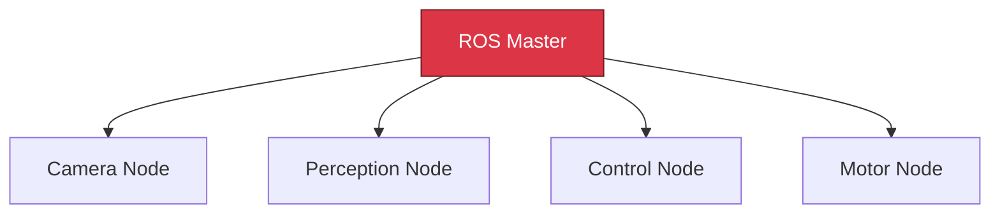
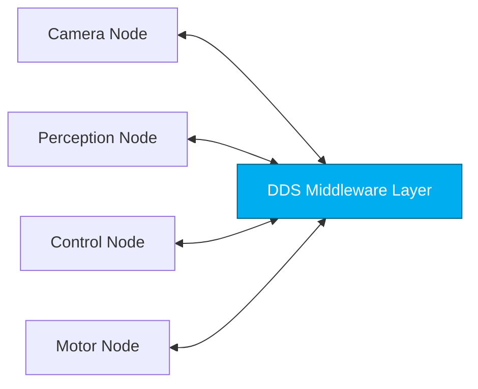
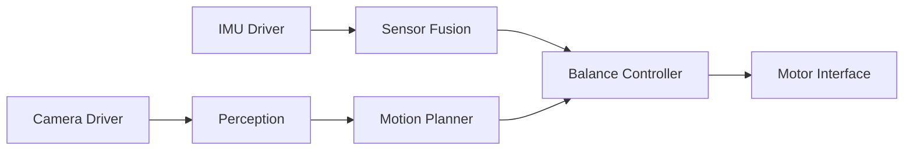
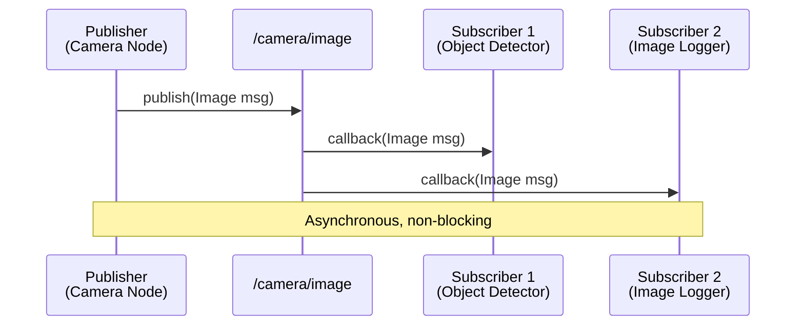
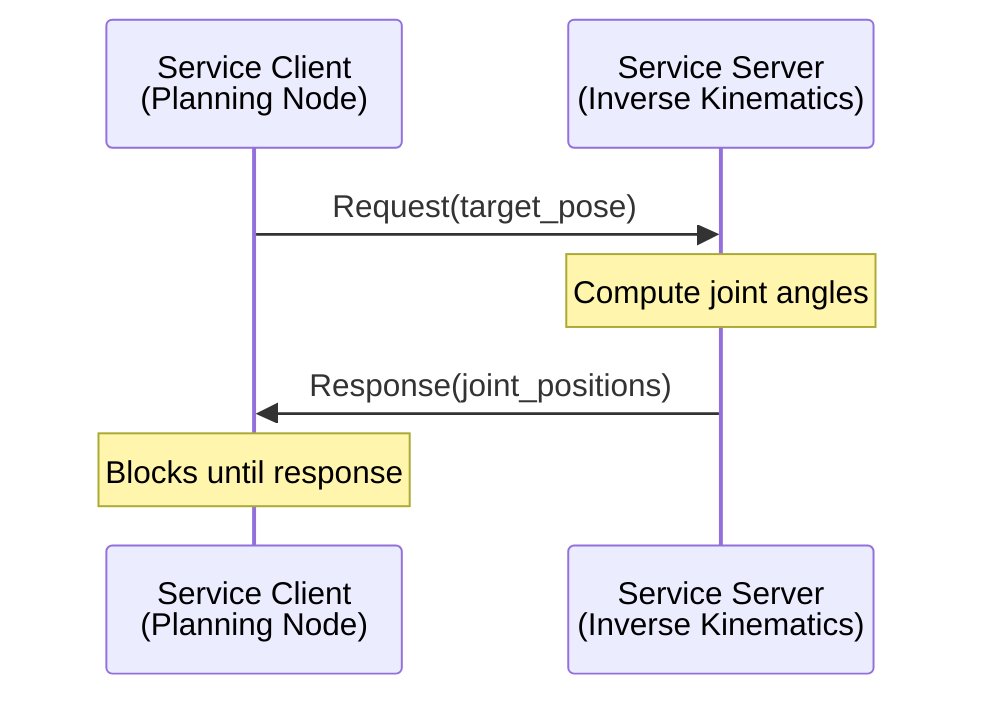
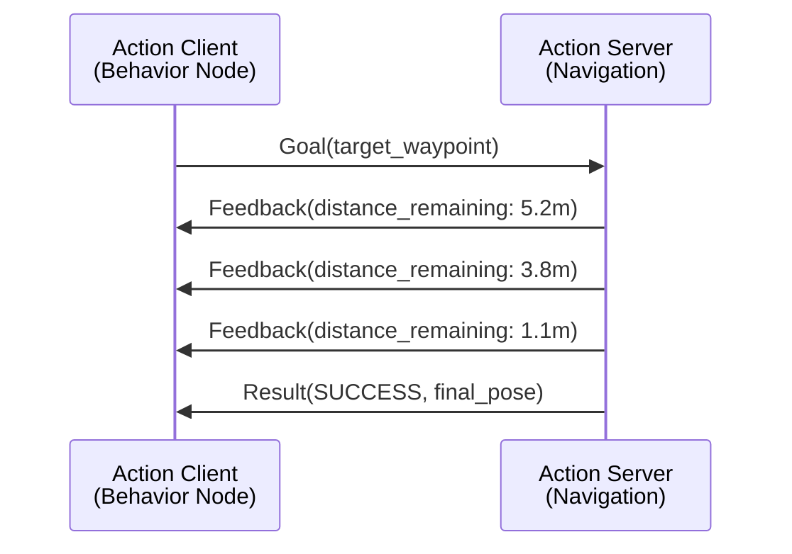

# Chapter 1: Introduction to ROS 2

Welcome to your first chapter in the Robot Operating System 2 (ROS 2)! If you're coming from an AI/ML background, you might be familiar with frameworks like PyTorch or TensorFlow that help you build neural networks. ROS 2 serves a similar purpose for robotics—it's a middleware framework that helps you build distributed robotic systems.

<ConceptCallout type="definition" title="What is ROS 2?">

**ROS 2 (Robot Operating System 2)** is an open-source middleware framework that provides:
- **Communication infrastructure** for distributed robotic systems
- **Standard interfaces** for sensors, actuators, and algorithms
- **Tools and libraries** for building, debugging, and deploying robot applications
- **Hardware abstraction** allowing code reuse across different robot platforms

Think of it as the "nervous system" that connects all parts of your robot together.

</ConceptCallout>

## 1.1 Why ROS 2? The Evolution from ROS 1

If you research robotics online, you'll encounter both ROS 1 and ROS 2. Understanding why ROS 2 exists will help you appreciate its design decisions.

### The ROS 1 Architecture Problem

ROS 1 (released in 2007) relied on a **master node** architecture:



**Single Point of Failure**: If the ROS Master crashes, the entire robotic system stops communicating. This is unacceptable for production robots, especially humanoids operating in unstructured environments.

<ConceptCallout type="warning" title="ROS 1 is Legacy">

While ROS 1 (Noetic) is still used in some legacy systems, it reached end-of-life in May 2025. **All new robotics projects should use ROS 2.** This course focuses exclusively on ROS 2 Humble Hawksbill LTS.

</ConceptCallout>

### The ROS 2 Distributed Architecture

ROS 2 eliminated the master node by adopting **DDS (Data Distribution Service)**, a proven middleware standard used in aerospace, defense, and industrial systems.



**Key Improvements**:
- **No single point of failure**: Nodes discover each other peer-to-peer
- **Real-time performance**: Deterministic communication with configurable QoS
- **Security**: Built-in authentication and encryption (SROS2)
- **Multi-robot support**: Nodes can communicate across networks seamlessly

<ConceptCallout type="concept">

**DDS (Data Distribution Service)** is an Object Management Group (OMG) standard for real-time, scalable, publish-subscribe communication. It handles:
- **Service discovery**: Nodes find each other automatically without a central broker
- **Quality of Service (QoS)**: Reliability, durability, and latency guarantees
- **Data serialization**: Efficient binary encoding for network transmission

Popular DDS implementations: Fast DDS (default in ROS 2 Humble), Cyclone DDS, RTI Connext DDS.

</ConceptCallout>

## 1.2 Core Concepts: The Computational Graph

ROS 2 represents your robot as a **computational graph** where:
- **Nodes** are processes that perform computation (vertices in the graph)
- **Communication channels** connect nodes (edges in the graph)

### 1.2.1 Nodes

<ConceptCallout type="definition" title="What is a Node?">

A **node** is an independent executable process that performs a specific task in your robotic system. Each node should have a **single, well-defined responsibility**.

Examples:
- A camera driver node that publishes image data
- A perception node that detects objects in images
- A planning node that generates motion trajectories
- A control node that sends commands to motors

</ConceptCallout>

**Design Philosophy**: ROS 2 encourages **many small nodes** rather than one monolithic program. This provides:
- **Modularity**: Replace or upgrade individual components
- **Fault isolation**: One crashing node doesn't bring down the entire system
- **Parallel execution**: Nodes run on separate CPU cores automatically
- **Testability**: Test individual nodes in isolation

**Example Humanoid Robot System**:



Each box represents a separate node. This 6-node system is easier to develop, test, and debug than a single 10,000-line program.

### 1.2.2 Topics: Publish-Subscribe Communication

<ConceptCallout type="definition" title="What is a Topic?">

A **topic** is a named bus over which nodes exchange **messages**. Communication is:
- **Anonymous**: Publishers don't know who subscribes, subscribers don't know who publishes
- **Many-to-many**: Multiple publishers and subscribers on the same topic
- **Asynchronous**: No blocking; messages are queued

Use topics for **continuous data streams** (sensor readings, state updates, commands).

</ConceptCallout>

**Publish-Subscribe Pattern**:



**When to Use Topics**:
- ✅ Sensor data (camera images, IMU readings, joint states)
- ✅ Robot state (pose, velocity, battery level)
- ✅ Command streams (motor velocities, LED colors)
- ❌ Request-response patterns (use services instead)
- ❌ Guaranteed delivery requirements (configure QoS)

### 1.2.3 Services: Request-Response Communication

<ConceptCallout type="definition" title="What is a Service?">

A **service** is a synchronous request-response communication pattern:
- **One client** sends a request
- **One server** processes the request and returns a response
- Communication is **blocking**: client waits for response

Use services for **infrequent, atomic operations** (trigger a behavior, query robot state, reconfigure parameters).

</ConceptCallout>

**Service Call Pattern**:



**When to Use Services**:
- ✅ Compute intensive operations (inverse kinematics, path planning)
- ✅ Configuration queries (get/set parameters)
- ✅ Trigger actions (start/stop motors, reset odometry)
- ❌ High-frequency data (use topics instead)
- ❌ Long-running tasks (use actions instead)

### 1.2.4 Actions: Goal-Oriented Behavior

<ConceptCallout type="definition" title="What is an Action?">

An **action** is an extended request-response pattern for **long-running, goal-oriented tasks**:
- Client sends a **goal**
- Server provides **feedback** during execution
- Server returns a **result** when complete
- Client can **cancel** the goal mid-execution

Use actions for behaviors that take time and require progress updates (navigate to waypoint, grasp object, perform gesture).

</ConceptCallout>

**Action Communication Pattern**:



**When to Use Actions**:
- ✅ Navigation to waypoints
- ✅ Object manipulation sequences
- ✅ Autonomous behaviors (dance, wave, grasp)
- ✅ Long computations with progress tracking
- ❌ Simple on/off commands (use services)
- ❌ Continuous data streams (use topics)

## 1.3 ROS 2 Distributions

ROS 2 releases new distributions every 6-12 months, named alphabetically after turtles.

<ConceptCallout type="tip" title="Which Distribution Should I Use?">

**For this course, use ROS 2 Humble Hawksbill** (released May 2022):
- **Long-Term Support (LTS)**: Supported until May 2027
- **Platform**: Ubuntu 22.04 LTS (Jammy Jellyfish)
- **Stability**: Production-ready, widely adopted in industry
- **Python**: Requires Python 3.10+

**Avoid non-LTS releases** (Galactic, Iron) unless you need cutting-edge features—they have shorter support lifecycles.

</ConceptCallout>

| Distribution | Release | EOL | Ubuntu | Python | LTS |
|--------------|---------|-----|--------|--------|-----|
| **Humble Hawksbill** | May 2022 | May 2027 | 22.04 | 3.10+ | ✅ |
| Iron Irwini | May 2023 | Nov 2024 | 22.04 | 3.10+ | ❌ |
| Jazzy Jalisco | May 2024 | May 2029 | 24.04 | 3.12+ | ✅ |

## 1.4 Setting Up Your ROS 2 Environment

Before diving into code, ensure ROS 2 Humble is installed correctly.

### Installation Verification

Open a terminal and run:

<CodeExample language="bash" showLineNumbers={false}>
{`# Source ROS 2 environment
source /opt/ros/humble/setup.bash

# Verify installation
ros2 --version

# Expected output:
# ros2 cli version: 0.25.x

# List available commands
ros2 --help`}
</CodeExample>

<ConceptCallout type="warning" title="Environment Setup Required">

You **must** source the ROS 2 setup script in every new terminal:

```bash
source /opt/ros/humble/setup.bash
```

**Pro tip**: Add this line to your `~/.bashrc` to automatically source ROS 2 in all terminals:

```bash
echo "source /opt/ros/humble/setup.bash" >> ~/.bashrc
```

</ConceptCallout>

### Your First ROS 2 Command: Viewing the Computational Graph

Let's explore a live ROS 2 system using the `turtlesim` demo:

<CodeExample language="bash" showLineNumbers={false}>
{`# Terminal 1: Start the turtlesim node
ros2 run turtlesim turtlesim_node

# Terminal 2: Start the keyboard teleop node
ros2 run turtlesim turtle_teleop_key

# Terminal 3: View active nodes
ros2 node list

# Expected output:
# /turtlesim
# /teleop_turtle

# Terminal 3: View active topics
ros2 topic list

# Expected output:
# /turtle1/cmd_vel
# /turtle1/color_sensor
# /turtle1/pose`}
</CodeExample>

You just created a 2-node computational graph! The `turtle_teleop_key` node publishes to `/turtle1/cmd_vel`, and `turtlesim` subscribes to it.

### Visualizing the Computational Graph

ROS 2 includes `rqt_graph`, a tool to visualize node connections:

<CodeExample language="bash" showLineNumbers={false}>
{`# Terminal 4: Launch rqt_graph
ros2 run rqt_graph rqt_graph`}
</CodeExample>

You'll see:
- **Nodes**: Ovals representing processes
- **Topics**: Rectangles representing message buses
- **Edges**: Arrows showing publish/subscribe relationships

## 1.5 Hands-On Exercise: Exploring a ROS 2 System

<ExerciseBlock
  title="Explore the Turtlesim Computational Graph"
  difficulty="beginner"
  estimatedTime={20}
  objectives={[
    "Launch multiple ROS 2 nodes using ros2 run",
    "Inspect active topics and their message types",
    "Echo topic data in real-time to understand data flow"
  ]}
  hints={[
    "Use 'ros2 topic info /topic_name' to see publishers and subscribers",
    "Use 'ros2 interface show geometry_msgs/msg/Twist' to see message structure",
    "Press Ctrl+C to stop any ROS 2 node cleanly"
  ]}
>

### Problem Statement

You are analyzing an existing ROS 2 system (turtlesim) to understand how nodes communicate. Your task is to identify:
1. What message type is used for controlling the turtle's velocity?
2. What data does the `/turtle1/pose` topic publish?
3. How many subscribers are listening to `/turtle1/cmd_vel`?

### Requirements

1. **Launch the turtlesim system** (2 nodes: `turtlesim_node` and `turtle_teleop_key`)
2. **Inspect topic details** using `ros2 topic info`
3. **View message structure** using `ros2 interface show`
4. **Echo topic data** using `ros2 topic echo /turtle1/pose` (move the turtle and observe output)

### Testing

```bash
# Verify turtlesim is running
ros2 node list
# Should show: /turtlesim and /teleop_turtle

# Inspect the velocity command topic
ros2 topic info /turtle1/cmd_vel
# Expected: Message type geometry_msgs/msg/Twist

# View message fields
ros2 interface show geometry_msgs/msg/Twist

# Echo pose data (press arrow keys in teleop terminal)
ros2 topic echo /turtle1/pose
```

### Deliverable

Answer these questions:
1. What are the two main fields in a `Twist` message? (Hint: linear and angular velocities)
2. At what frequency (Hz) does `/turtle1/pose` publish data? (Use `ros2 topic hz /turtle1/pose`)
3. What happens when you kill the `turtle_teleop_key` node? (Does turtlesim still receive commands?)

</ExerciseBlock>

## Key Takeaways

<div className="key-takeaways">

### ✓ Core Concepts Mastered

- **ROS 2 uses a distributed, peer-to-peer architecture** (no master node) powered by DDS middleware for fault tolerance and scalability
- **Nodes are independent processes** with single responsibilities, allowing modular, testable robotic systems
- **Topics provide asynchronous publish-subscribe communication** for continuous data streams (sensors, state, commands)
- **Services provide synchronous request-response communication** for infrequent, atomic operations (queries, triggers)
- **Actions extend services with feedback and cancellation** for long-running, goal-oriented tasks (navigation, manipulation)
- **ROS 2 Humble Hawksbill LTS** is the recommended distribution for production systems (Ubuntu 22.04, supported until 2027)

</div>

## What's Next?

In **Chapter 2: ROS 2 Nodes and Topics**, you'll write your first Python code using `rclpy` to create publishers and subscribers. You'll learn:
- How to create custom ROS 2 packages
- Writing publisher nodes that send sensor data
- Writing subscriber nodes that process incoming messages
- Configuring Quality of Service (QoS) for reliable communication

**Prerequisite Check**: Before proceeding, ensure you can:
- ✅ Explain the difference between ROS 1 and ROS 2 architectures
- ✅ Define nodes, topics, services, and actions
- ✅ Run `ros2 node list` and `ros2 topic list` successfully
- ✅ Visualize a computational graph using `rqt_graph`

---

**Next**: Chapter 2: ROS 2 Nodes and Topics (coming soon)
