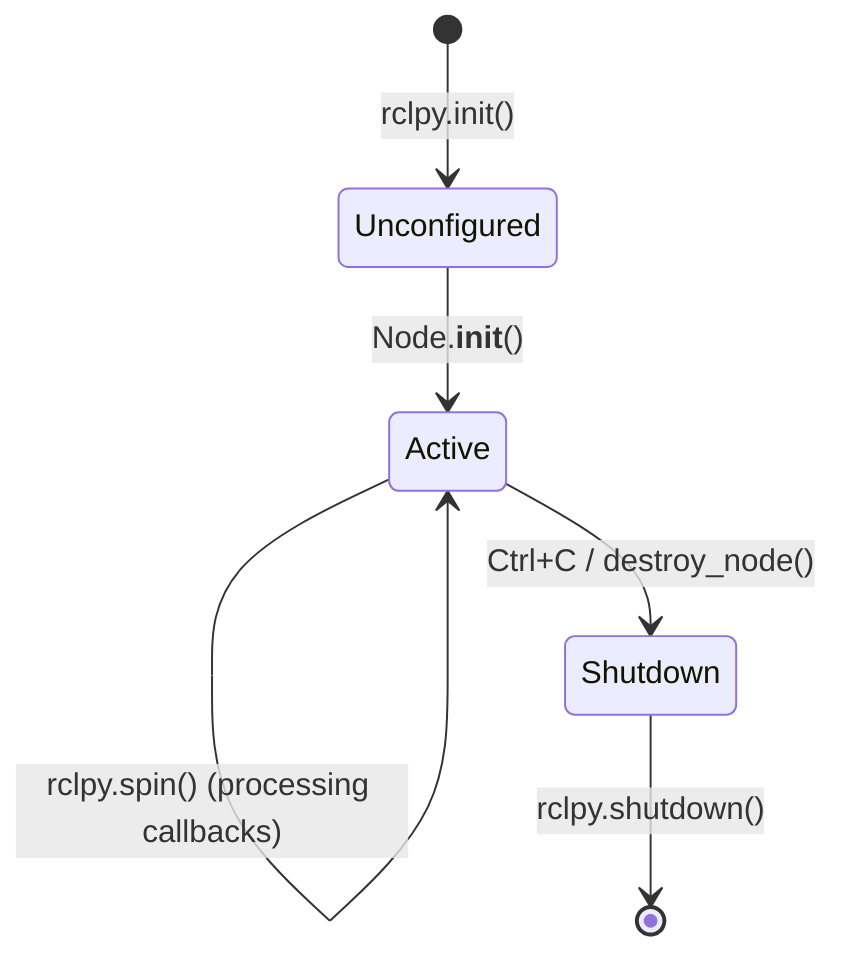
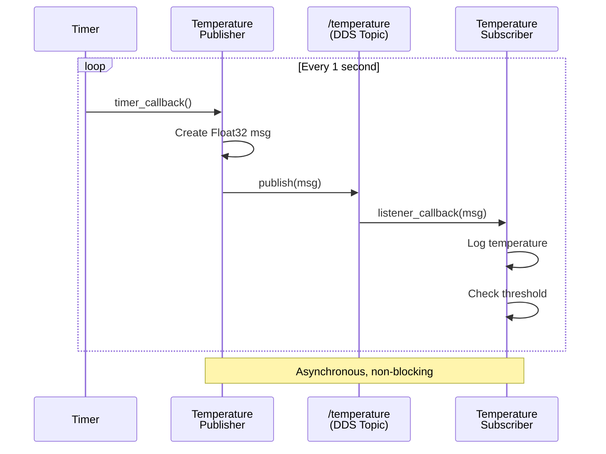

# Chapter 2: ROS 2 Nodes and Topics

Welcome to hands-on ROS 2 programming! In Chapter 1, you learned the conceptual foundations—nodes, topics, services, and the computational graph. Now you'll write Python code using **rclpy** (ROS Client Library for Python) to create nodes that communicate via topics.

By the end of this chapter, you'll build a temperature monitoring system with a sensor node publishing data and a monitor node subscribing to it—your first multi-node ROS 2 application.

## 2.1 Understanding Nodes

Every ROS 2 application starts with nodes. A node is a process that performs computation—reading sensors, processing data, controlling motors, etc.

<ConceptCallout type="definition" title="What is rclpy?">

**rclpy** is the official Python client library for ROS 2. It provides:
- **Node class**: Base class for creating ROS 2 nodes
- **Communication primitives**: Publishers, subscribers, services, actions
- **Lifecycle management**: Initialization, spinning, shutdown
- **Utilities**: Logging, time management, parameter handling

Think of rclpy as the Python API for interacting with the ROS 2 middleware (DDS).

</ConceptCallout>

### 2.1.1 Basic Node Structure

Every rclpy node follows this pattern:

<CodeExample language="python" filename="minimal_node.py" difficulty="beginner">
{`import rclpy
from rclpy.node import Node

class MinimalNode(Node):
    def __init__(self):
        super().__init__('minimal_node')  # Node name
        self.get_logger().info('Minimal node has been started')

def main(args=None):
    rclpy.init(args=args)  # Initialize ROS 2 communication
    node = MinimalNode()
    rclpy.spin(node)  # Keep node alive
    node.destroy_node()
    rclpy.shutdown()  # Cleanup

if __name__ == '__main__':
    main()
`}
</CodeExample>

**Key Components Explained:**

1. **`rclpy.init()`**: Initializes the ROS 2 client library. Must be called before creating nodes.
2. **`Node` class**: Base class providing all ROS 2 functionality. Pass a unique node name to `super().__init__()`.
3. **`rclpy.spin()`**: Blocks and processes callbacks (subscriptions, timers, services). Without this, your node exits immediately.
4. **`destroy_node()` / `shutdown()`**: Clean up resources when the node exits.

<ConceptCallout type="tip" title="Node Names Must Be Unique">

Each node in a ROS 2 system must have a unique name. If you launch two nodes with the same name, the newer one will cause a naming conflict. Use descriptive names like `camera_driver`, `perception_node`, `motor_controller`.

</ConceptCallout>

### 2.1.2 Node Lifecycle



**Lifecycle States:**
- **Unconfigured**: ROS 2 initialized, but no nodes created yet
- **Active**: Node running, processing callbacks (subscriptions, timers, services)
- **Shutdown**: Node destroyed, resources released

## 2.2 Publisher/Subscriber Pattern

The **publish-subscribe** pattern is the most common ROS 2 communication method for streaming data (sensor readings, robot state, commands).

### 2.2.1 Creating a Publisher

A **publisher** sends messages to a topic at regular intervals.

<CodeExample language="python" filename="temperature_publisher.py" difficulty="beginner" estimatedTime={15}>
{`import rclpy
from rclpy.node import Node
from std_msgs.msg import Float32

class TemperaturePublisher(Node):
    def __init__(self):
        super().__init__('temperature_publisher')

        # Create publisher: message type Float32, topic '/temperature', queue size 10
        self.publisher_ = self.create_publisher(Float32, 'temperature', 10)

        # Create timer: call timer_callback every 1.0 seconds
        self.timer = self.create_timer(1.0, self.timer_callback)

        self.temperature = 20.0  # Simulated temperature in Celsius
        self.get_logger().info('Temperature Publisher started')

    def timer_callback(self):
        msg = Float32()
        msg.data = self.temperature

        self.publisher_.publish(msg)
        self.get_logger().info(f'Publishing temperature: {msg.data:.2f}°C')

        # Simulate temperature fluctuation
        self.temperature += 0.5

def main(args=None):
    rclpy.init(args=args)
    node = TemperaturePublisher()
    rclpy.spin(node)
    node.destroy_node()
    rclpy.shutdown()

if __name__ == '__main__':
    main()
`}
</CodeExample>

**Publisher API Breakdown:**

```python
self.publisher_ = self.create_publisher(
    msg_type=Float32,          # Message type (from std_msgs.msg)
    topic='temperature',       # Topic name
    qos_profile=10             # Queue size (or QoSProfile object)
)
```

- **`msg_type`**: The message type (e.g., `Float32`, `String`, `Twist`). Subscribers must use the same type.
- **`topic`**: Topic name (string). Conventionally uses lowercase with underscores.
- **`qos_profile`**: Integer (queue size) or `QoSProfile` object (covered in Section 2.3).

**Timer for Periodic Publishing:**

```python
self.timer = self.create_timer(
    timer_period_sec=1.0,      # Publish every 1 second
    callback=self.timer_callback  # Function to call
)
```

Timers are essential for periodic tasks like sensor sampling or control loops.

### 2.2.2 Creating a Subscriber

A **subscriber** receives messages from a topic and processes them in a callback function.

<CodeExample language="python" filename="temperature_subscriber.py" difficulty="beginner" estimatedTime={15}>
{`import rclpy
from rclpy.node import Node
from std_msgs.msg import Float32

class TemperatureSubscriber(Node):
    def __init__(self):
        super().__init__('temperature_subscriber')

        # Create subscriber: message type Float32, topic '/temperature', callback function
        self.subscription = self.create_subscription(
            Float32,
            'temperature',
            self.listener_callback,
            10  # Queue size
        )

        self.get_logger().info('Temperature Subscriber started')

    def listener_callback(self, msg):
        """Called every time a message is received"""
        self.get_logger().info(f'Received temperature: {msg.data:.2f}°C')

        # Add temperature warning logic
        if msg.data > 30.0:
            self.get_logger().warn(f'HIGH TEMPERATURE ALERT: {msg.data:.2f}°C')

def main(args=None):
    rclpy.init(args=args)
    node = TemperatureSubscriber()
    rclpy.spin(node)
    node.destroy_node()
    rclpy.shutdown()

if __name__ == '__main__':
    main()
`}
</CodeExample>

**Subscriber API Breakdown:**

```python
self.subscription = self.create_subscription(
    msg_type=Float32,               # Must match publisher's message type
    topic='temperature',            # Must match publisher's topic name
    callback=self.listener_callback,  # Function to call when message arrives
    qos_profile=10                  # Queue size (or QoSProfile object)
)
```

**Callback Function Signature:**

```python
def listener_callback(self, msg):
    # msg is an instance of Float32 (or whatever msg_type you specified)
    temperature_value = msg.data
    # Process the message...
```

Callbacks execute asynchronously whenever a message arrives. Keep them short (< 10ms) to avoid blocking other callbacks.

### 2.2.3 Communication Flow



**Running the Example:**

Open two terminals and source ROS 2:

```bash
# Terminal 1: Run publisher
source /opt/ros/humble/setup.bash
python3 temperature_publisher.py

# Terminal 2: Run subscriber
source /opt/ros/humble/setup.bash
python3 temperature_subscriber.py
```

You'll see the publisher logging temperatures and the subscriber receiving them in real-time.

## 2.3 Quality of Service (QoS)

Quality of Service (QoS) policies control **how** messages are delivered between publishers and subscribers. This is critical for robotics where some data (sensor readings) can be dropped, but other data (safety commands) must be guaranteed.

<ConceptCallout type="concept" title="Why QoS Matters in Robotics">

Different data streams have different requirements:
- **Camera images (30 FPS)**: Dropping occasional frames is acceptable. Use "best effort" delivery.
- **Safety stop commands**: Must be delivered reliably. Use "reliable" delivery with retransmission.
- **Sensor data**: Latest value is most important. Use "keep last" with history depth 1.
- **Log messages**: All messages matter. Use "reliable" with larger history depth.

QoS lets you optimize for latency, bandwidth, and reliability based on your application's needs.

</ConceptCallout>

### 2.3.1 QoS Policies

ROS 2 uses DDS QoS policies. The most important ones are:

| Policy | Options | Use Case |
|--------|---------|----------|
| **Reliability** | `RELIABLE`, `BEST_EFFORT` | Reliable: retransmit lost packets (e.g., commands). Best-effort: no retries (e.g., high-frequency sensor data) |
| **Durability** | `TRANSIENT_LOCAL`, `VOLATILE` | Transient: new subscribers get last message. Volatile: only get messages after subscription |
| **History** | `KEEP_LAST(n)`, `KEEP_ALL` | Keep last N messages or all messages in queue |
| **Deadline** | Time duration | Expect messages within deadline (e.g., 100ms). Trigger callback if missed |
| **Lifespan** | Time duration | Messages expire after lifespan (e.g., 1 second old commands ignored) |

### 2.3.2 Using QoS Profiles

<CodeExample language="python" filename="qos_example.py" difficulty="intermediate">
{`import rclpy
from rclpy.node import Node
from rclpy.qos import QoSProfile, ReliabilityPolicy, HistoryPolicy, DurabilityPolicy
from std_msgs.msg import String

class QoSExampleNode(Node):
    def __init__(self):
        super().__init__('qos_example_node')

        # Create custom QoS profile for sensor data
        sensor_qos = QoSProfile(
            reliability=ReliabilityPolicy.BEST_EFFORT,  # Don't retransmit
            history=HistoryPolicy.KEEP_LAST,            # Keep only latest message
            depth=1,                                     # Queue size 1
            durability=DurabilityPolicy.VOLATILE        # Don't persist for late subscribers
        )

        # Create custom QoS profile for commands (reliable delivery)
        command_qos = QoSProfile(
            reliability=ReliabilityPolicy.RELIABLE,     # Retransmit until ACK
            history=HistoryPolicy.KEEP_LAST,
            depth=10,                                    # Buffer up to 10 commands
            durability=DurabilityPolicy.TRANSIENT_LOCAL  # Late subscribers get last message
        )

        # Publishers with different QoS
        self.sensor_pub = self.create_publisher(String, 'sensor_data', sensor_qos)
        self.command_pub = self.create_publisher(String, 'commands', command_qos)

        self.get_logger().info('QoS Example Node started')

def main(args=None):
    rclpy.init(args=args)
    node = QoSExampleNode()
    rclpy.spin(node)
    node.destroy_node()
    rclpy.shutdown()

if __name__ == '__main__':
    main()
`}
</CodeExample>

<ConceptCallout type="warning" title="QoS Compatibility">

**Publishers and subscribers must have compatible QoS profiles to communicate!**

- `RELIABLE` publisher ↔️ `RELIABLE` subscriber ✅
- `BEST_EFFORT` publisher ↔️ `BEST_EFFORT` subscriber ✅
- `RELIABLE` publisher ↔️ `BEST_EFFORT` subscriber ✅
- `BEST_EFFORT` publisher ↔️ `RELIABLE` subscriber ❌ (no connection)

If messages aren't flowing, use `ros2 topic info /topic_name --verbose` to check QoS compatibility.

</ConceptCallout>

### 2.3.3 Predefined QoS Profiles

ROS 2 provides common presets:

<CodeExample language="python" showLineNumbers={false}>
{`from rclpy.qos import qos_profile_sensor_data, qos_profile_system_default

# Use sensor data preset (best-effort, keep last 1)
self.sensor_pub = self.create_publisher(
    Image,
    'camera/image',
    qos_profile_sensor_data
)

# Use system default preset (reliable, keep last 10)
self.command_pub = self.create_publisher(
    Twist,
    'cmd_vel',
    qos_profile_system_default
)
`}
</CodeExample>

**Common Presets:**
- `qos_profile_sensor_data`: Best-effort, keep last 5, volatile
- `qos_profile_system_default`: Reliable, keep last 10, volatile
- `qos_profile_services_default`: Reliable, keep last 10, volatile
- `qos_profile_parameters`: Reliable, keep last 1000, transient local

## 2.4 Introspection Tools

ROS 2 provides powerful CLI tools to inspect running systems without modifying code.

### 2.4.1 Node Introspection

<CodeExample language="bash" showLineNumbers={false}>
{`# List all active nodes
ros2 node list

# Get detailed info about a node
ros2 node info /temperature_publisher

# Output:
# /temperature_publisher
#   Subscribers:
#     /parameter_events: rcl_interfaces/msg/ParameterEvent
#   Publishers:
#     /temperature: std_msgs/msg/Float32
#     /rosout: rcl_interfaces/msg/Log
#   Service Servers:
#     /temperature_publisher/describe_parameters: rcl_interfaces/srv/DescribeParameters
#   Service Clients:
#   Action Servers:
#   Action Clients:
`}
</CodeExample>

### 2.4.2 Topic Introspection

<CodeExample language="bash" showLineNumbers={false}>
{`# List all active topics
ros2 topic list

# Get topic type
ros2 topic type /temperature
# Output: std_msgs/msg/Float32

# Get detailed topic info (publishers, subscribers, QoS)
ros2 topic info /temperature --verbose

# Echo messages in real-time
ros2 topic echo /temperature

# Measure publishing frequency
ros2 topic hz /temperature

# Publish a message from command line
ros2 topic pub /temperature std_msgs/msg/Float32 "{data: 25.5}"
`}
</CodeExample>

### 2.4.3 Debugging Communication Issues

<ConceptCallout type="tip" title="Common Debugging Workflow">

When nodes don't communicate:

1. **Verify both nodes are running**: `ros2 node list`
2. **Check topic names match**: `ros2 topic list` (typos are common!)
3. **Verify message types match**: `ros2 topic info /topic_name`
4. **Check QoS compatibility**: `ros2 topic info /topic_name --verbose`
5. **Echo the topic**: `ros2 topic echo /topic_name` (are messages flowing?)
6. **Check frequency**: `ros2 topic hz /topic_name` (is rate correct?)

</ConceptCallout>

## 2.5 Hands-On Exercise: Build a Temperature Monitor

<ExerciseBlock
  title="Temperature Monitoring System"
  difficulty="beginner"
  estimatedTime={30}
  objectives={[
    "Create a publisher node that simulates temperature sensor readings",
    "Create a subscriber node that monitors temperature and logs warnings",
    "Use ROS 2 CLI tools to inspect the system and verify message flow",
    "Experiment with QoS policies to understand reliability settings"
  ]}
  hints={[
    "Use create_timer() with 0.5 second period for faster updates",
    "Add random temperature fluctuations using Python's random module",
    "Log warnings when temperature exceeds 30°C or drops below 10°C",
    "Try changing QoS from RELIABLE to BEST_EFFORT and observe behavior"
  ]}
>

### Problem Statement

You are building a temperature monitoring system for a robotics lab. The system has:
1. **Sensor Node**: Simulates a temperature sensor that publishes readings every 0.5 seconds
2. **Monitor Node**: Subscribes to temperature data and logs warnings for extreme values

### Requirements

**Temperature Sensor Node** (`temperature_sensor.py`):
- Publish to `/lab/temperature` topic (type: `std_msgs/msg/Float32`)
- Initial temperature: 22.0°C
- Add random fluctuation: `random.uniform(-1.0, 1.0)` degrees per reading
- Log each published temperature
- Use QoS: Reliable, Keep Last 10

**Temperature Monitor Node** (`temperature_monitor.py`):
- Subscribe to `/lab/temperature` topic
- Log all received temperatures
- **Warn** if temperature > 30°C: "HIGH TEMPERATURE ALERT"
- **Warn** if temperature < 10°C: "LOW TEMPERATURE ALERT"
- Use QoS: Reliable, Keep Last 10

### Testing

```bash
# Terminal 1: Run sensor
python3 temperature_sensor.py

# Terminal 2: Run monitor
python3 temperature_monitor.py

# Terminal 3: Inspect system
ros2 node list
ros2 topic list
ros2 topic info /lab/temperature
ros2 topic echo /lab/temperature
ros2 topic hz /lab/temperature

# Expected: ~2 Hz (0.5 second period)
```

### Deliverable

1. Two working Python files: `temperature_sensor.py` and `temperature_monitor.py`
2. Screenshot of both nodes running with temperature warnings appearing
3. Answer: What happens when you kill the sensor node? (Monitor stops receiving messages, but doesn't crash)
4. Answer: What happens when you change sensor to `BEST_EFFORT` and monitor to `RELIABLE`? (No communication - QoS mismatch)

</ExerciseBlock>

## Key Takeaways

<div className="key-takeaways">

### ✓ Core Concepts Mastered

- **rclpy provides the Python API for ROS 2** with the Node class as the foundation for all node implementations
- **Publishers send messages to topics** using `create_publisher()` and timers for periodic publishing
- **Subscribers receive messages from topics** using `create_subscription()` with callback functions for asynchronous processing
- **Quality of Service (QoS) policies control message delivery** with reliability (reliable vs. best-effort), durability (volatile vs. transient), and history (keep last N) settings
- **QoS compatibility matters**: Publishers and subscribers must have compatible QoS profiles (e.g., BEST_EFFORT publisher cannot connect to RELIABLE subscriber)
- **ROS 2 CLI tools enable debugging** with `ros2 node list/info`, `ros2 topic list/echo/hz/info` for inspecting running systems
- **Node lifecycle follows init → spin → shutdown** with `rclpy.init()`, `rclpy.spin()`, and `rclpy.shutdown()`

</div>

## What's Next?

In **Chapter 3: Python and rclpy Deep Dive**, you'll learn advanced rclpy patterns:
- Service clients and servers for request-response communication
- Action servers for long-running tasks with feedback
- Parameters for runtime configuration
- Callback groups for managing concurrent execution
- Integration patterns for AI agents (bridging AI logic with ROS nodes)

**Prerequisite Check**: Before proceeding, ensure you can:
- ✅ Create a publisher node that sends messages at a fixed rate
- ✅ Create a subscriber node that processes messages in a callback
- ✅ Explain the difference between RELIABLE and BEST_EFFORT QoS
- ✅ Use `ros2 topic echo` and `ros2 topic hz` to debug communication

---

**Next**: Chapter 3: Python and rclpy Deep Dive (coming soon)
