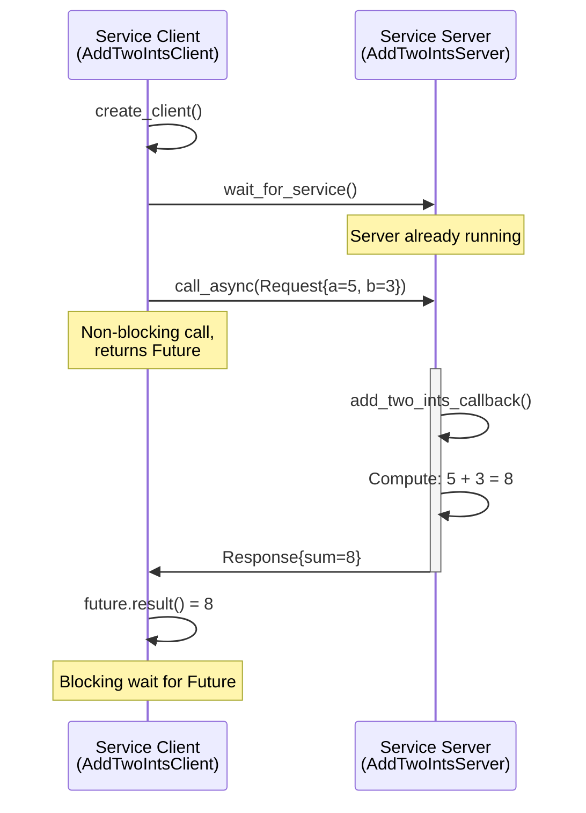
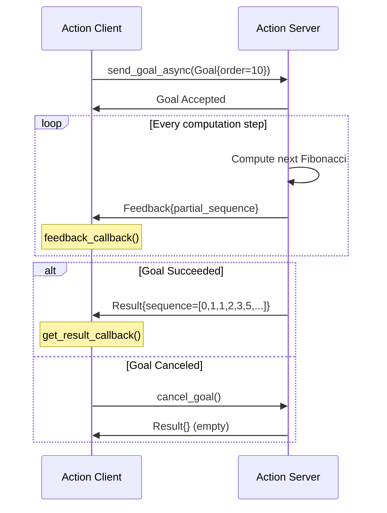

# Chapter 3: Services, Actions, and Parameters

In Chapter 2, you learned about **topics**—the asynchronous, many-to-many communication pattern ideal for streaming sensor data. But not all robot communication fits the publish-subscribe model. What if you need:

- **A one-time computation** (e.g., inverse kinematics for an arm)?
  → Use **services** (synchronous request-response)
- **A long-running task with progress updates** (e.g., navigate to a waypoint)?
  → Use **actions** (asynchronous with feedback)
- **Configurable behavior** (e.g., adjust PID gains at runtime)?
  → Use **parameters** (dynamic configuration)

This chapter teaches you these advanced communication primitives and shows how to integrate **AI decision logic** with ROS 2 control systems.

## 3.1 Services: Request-Response Communication

<ConceptCallout type="definition" title="What is a Service?">

A **service** is a synchronous, one-to-one communication pattern:
- **Client** sends a **request** to a **server**
- **Server** processes the request and returns a **response**
- Communication is **blocking**: client waits for the response (or times out)

Use services for:
- ✅ Infrequent operations (trigger calibration, query robot state)
- ✅ Computationally intensive tasks (path planning, inverse kinematics)
- ✅ Configuration changes (reset odometry, switch modes)
- ❌ High-frequency data streams (use topics)
- ❌ Tasks taking > 1 second (use actions for feedback)

</ConceptCallout>

### 3.1.1 Service Definitions

ROS 2 services use `.srv` files defining request and response types:

```
# example_interfaces/srv/AddTwoInts.srv
int64 a
int64 b
---
int64 sum
```

The `---` separator divides request (top) from response (bottom). Standard service types include:
- `std_srvs/srv/Trigger`: No request data, bool response + message
- `std_srvs/srv/SetBool`: Bool request, bool response + message
- `example_interfaces/srv/AddTwoInts`: Two integers → sum

### 3.1.2 Creating a Service Server

A **service server** listens for requests and executes a callback function:

<CodeExample language="python" filename="add_two_ints_server.py" difficulty="intermediate" estimatedTime={20}>
{`import rclpy
from rclpy.node import Node
from example_interfaces.srv import AddTwoInts

class AddTwoIntsServer(Node):
    def __init__(self):
        super().__init__('add_two_ints_server')

        # Create service: service type, service name, callback function
        self.srv = self.create_service(
            AddTwoInts,
            'add_two_ints',
            self.add_two_ints_callback
        )

        self.get_logger().info('Add Two Ints Server started')

    def add_two_ints_callback(self, request, response):
        """Service callback: receives request, populates response"""
        response.sum = request.a + request.b
        self.get_logger().info(
            f'Incoming request: a={request.a}, b={request.b}'
        )
        self.get_logger().info(f'Sending response: sum={response.sum}')
        return response

def main(args=None):
    rclpy.init(args=args)
    node = AddTwoIntsServer()
    rclpy.spin(node)
    node.destroy_node()
    rclpy.shutdown()

if __name__ == '__main__':
    main()
`}
</CodeExample>

**Service Server API:**

```python
self.srv = self.create_service(
    srv_type=AddTwoInts,           # Service type (from .srv file)
    srv_name='add_two_ints',       # Service name (string)
    callback=self.callback_function  # Function to handle requests
)
```

**Callback Signature:**

```python
def callback(self, request, response):
    # request: object with fields from request part of .srv
    # response: object with fields from response part of .srv
    response.field1 = compute_value()
    return response  # MUST return response object
```

### 3.1.3 Creating a Service Client

A **service client** sends requests and waits for responses:

<CodeExample language="python" filename="add_two_ints_client.py" difficulty="intermediate" estimatedTime={20}>
{`import sys
import rclpy
from rclpy.node import Node
from example_interfaces.srv import AddTwoInts

class AddTwoIntsClient(Node):
    def __init__(self):
        super().__init__('add_two_ints_client')

        # Create client: service type, service name
        self.client = self.create_client(AddTwoInts, 'add_two_ints')

        # Wait for service to be available (timeout after 5 seconds)
        while not self.client.wait_for_service(timeout_sec=5.0):
            self.get_logger().info('Service not available, waiting...')

        self.req = AddTwoInts.Request()

    def send_request(self, a, b):
        """Send async request and return future"""
        self.req.a = a
        self.req.b = b
        self.future = self.client.call_async(self.req)
        return self.future

def main(args=None):
    rclpy.init(args=args)

    if len(sys.argv) != 3:
        print('Usage: python3 add_two_ints_client.py <a> <b>')
        return

    client_node = AddTwoIntsClient()
    future = client_node.send_request(int(sys.argv[1]), int(sys.argv[2]))

    # Spin until response received
    rclpy.spin_until_future_complete(client_node, future)

    if future.result() is not None:
        response = future.result()
        client_node.get_logger().info(
            f'Result: {sys.argv[1]} + {sys.argv[2]} = {response.sum}'
        )
    else:
        client_node.get_logger().error('Service call failed')

    client_node.destroy_node()
    rclpy.shutdown()

if __name__ == '__main__':
    main()
`}
</CodeExample>

**Service Client API:**

```python
# 1. Create client
self.client = self.create_client(AddTwoInts, 'add_two_ints')

# 2. Wait for service availability
self.client.wait_for_service(timeout_sec=5.0)

# 3. Create request object
request = AddTwoInts.Request()
request.a = 10
request.b = 20

# 4. Call service asynchronously
future = self.client.call_async(request)

# 5. Wait for response
rclpy.spin_until_future_complete(node, future)
response = future.result()
```

### 3.1.4 Service Communication Flow



<ConceptCallout type="tip" title="Async vs Blocking Service Calls">

ROS 2 supports two service call patterns:

**Async (Recommended)**:
```python
future = self.client.call_async(request)
rclpy.spin_until_future_complete(node, future)
response = future.result()
```
- Non-blocking: node can process other callbacks while waiting
- Better for multi-node systems

**Synchronous (Legacy, avoid)**:
```python
response = self.client.call(request)  # Blocks entire node!
```
- Blocks node from processing other callbacks
- Can cause deadlocks in complex systems

</ConceptCallout>

## 3.2 Actions: Long-Running Tasks with Feedback

Services are great for quick computations, but what about tasks that take seconds or minutes? **Actions** extend the service pattern with:
- **Feedback**: Server sends progress updates during execution
- **Cancellation**: Client can cancel the goal mid-execution
- **Result**: Final outcome when task completes

<ConceptCallout type="concept" title="When to Use Actions">

Use actions for tasks that:
- ✅ Take > 1 second to complete (navigation, object manipulation)
- ✅ Require progress updates (distance to goal, current phase)
- ✅ Can be cancelled (stop navigation, abort grasp)
- ✅ Have distinct success/failure outcomes

Examples:
- Navigate to waypoint (feedback: distance remaining)
- Grasp object (feedback: gripper closure percentage)
- Execute dance sequence (feedback: current pose index)
- Train neural network (feedback: epoch, loss)

</ConceptCallout>

### 3.2.1 Action Definitions

Actions use `.action` files with three parts:

```
# example_interfaces/action/Fibonacci.action
# Goal
int32 order
---
# Result
int32[] sequence
---
# Feedback
int32[] partial_sequence
```

**Three sections**:
1. **Goal**: What the client requests (e.g., "navigate to (x, y)")
2. **Result**: Final outcome (e.g., "reached goal" or "failed - obstacle")
3. **Feedback**: Periodic updates (e.g., "50% complete, 2.3m remaining")

### 3.2.2 Creating an Action Server

<CodeExample language="python" filename="fibonacci_action_server.py" difficulty="advanced" estimatedTime={30}>
{`import time
import rclpy
from rclpy.node import Node
from rclpy.action import ActionServer
from example_interfaces.action import Fibonacci

class FibonacciActionServer(Node):
    def __init__(self):
        super().__init__('fibonacci_action_server')

        # Create action server: action type, action name, execute callback
        self._action_server = ActionServer(
            self,
            Fibonacci,
            'fibonacci',
            self.execute_callback
        )

        self.get_logger().info('Fibonacci Action Server started')

    def execute_callback(self, goal_handle):
        """Execute the action: generate Fibonacci sequence"""
        self.get_logger().info('Executing goal...')

        feedback_msg = Fibonacci.Feedback()
        feedback_msg.partial_sequence = [0, 1]

        # Generate Fibonacci sequence up to order N
        for i in range(1, goal_handle.request.order):
            # Check if cancellation requested
            if goal_handle.is_cancel_requested:
                goal_handle.canceled()
                self.get_logger().info('Goal canceled')
                return Fibonacci.Result()

            # Compute next Fibonacci number
            feedback_msg.partial_sequence.append(
                feedback_msg.partial_sequence[i] +
                feedback_msg.partial_sequence[i - 1]
            )

            # Publish feedback
            self.get_logger().info(
                f'Feedback: {feedback_msg.partial_sequence}'
            )
            goal_handle.publish_feedback(feedback_msg)

            time.sleep(1)  # Simulate long-running computation

        # Mark goal as succeeded and return result
        goal_handle.succeed()

        result = Fibonacci.Result()
        result.sequence = feedback_msg.partial_sequence
        self.get_logger().info(f'Result: {result.sequence}')
        return result

def main(args=None):
    rclpy.init(args=args)
    node = FibonacciActionServer()
    rclpy.spin(node)
    node.destroy_node()
    rclpy.shutdown()

if __name__ == '__main__':
    main()
`}
</CodeExample>

**Action Server API:**

```python
self._action_server = ActionServer(
    node=self,                     # Parent node
    action_type=Fibonacci,         # Action type
    action_name='fibonacci',       # Action name
    execute_callback=self.execute  # Callback function
)

def execute_callback(self, goal_handle):
    # 1. Access goal: goal_handle.request.field
    order = goal_handle.request.order

    # 2. Publish feedback periodically
    feedback = Fibonacci.Feedback()
    goal_handle.publish_feedback(feedback)

    # 3. Check for cancellation
    if goal_handle.is_cancel_requested:
        goal_handle.canceled()
        return Fibonacci.Result()

    # 4. Mark as succeeded and return result
    goal_handle.succeed()
    result = Fibonacci.Result()
    return result
```

### 3.2.3 Creating an Action Client

<CodeExample language="python" filename="fibonacci_action_client.py" difficulty="advanced" estimatedTime={25}>
{`import rclpy
from rclpy.node import Node
from rclpy.action import ActionClient
from example_interfaces.action import Fibonacci

class FibonacciActionClient(Node):
    def __init__(self):
        super().__init__('fibonacci_action_client')

        # Create action client
        self._action_client = ActionClient(
            self,
            Fibonacci,
            'fibonacci'
        )

    def send_goal(self, order):
        """Send goal and register callbacks"""
        goal_msg = Fibonacci.Goal()
        goal_msg.order = order

        self.get_logger().info('Waiting for action server...')
        self._action_client.wait_for_server()

        self.get_logger().info(f'Sending goal: order={order}')

        # Send goal with feedback callback
        self._send_goal_future = self._action_client.send_goal_async(
            goal_msg,
            feedback_callback=self.feedback_callback
        )

        # Register callback for goal acceptance
        self._send_goal_future.add_done_callback(self.goal_response_callback)

    def goal_response_callback(self, future):
        """Called when server accepts/rejects goal"""
        goal_handle = future.result()

        if not goal_handle.accepted:
            self.get_logger().info('Goal rejected')
            return

        self.get_logger().info('Goal accepted')

        # Get result asynchronously
        self._get_result_future = goal_handle.get_result_async()
        self._get_result_future.add_done_callback(self.get_result_callback)

    def feedback_callback(self, feedback_msg):
        """Called periodically during execution"""
        feedback = feedback_msg.feedback
        self.get_logger().info(
            f'Received feedback: {feedback.partial_sequence}'
        )

    def get_result_callback(self, future):
        """Called when action completes"""
        result = future.result().result
        self.get_logger().info(f'Result: {result.sequence}')
        rclpy.shutdown()

def main(args=None):
    rclpy.init(args=args)
    action_client = FibonacciActionClient()
    action_client.send_goal(10)
    rclpy.spin(action_client)

if __name__ == '__main__':
    main()
`}
</CodeExample>

### 3.2.4 Action Communication Flow



## 3.3 Parameters: Runtime Configuration

**Parameters** allow you to configure node behavior at runtime without restarting the node.

<ConceptCallout type="definition" title="What are Parameters?">

**Parameters** are key-value pairs stored in each node:
- Types: `bool`, `int`, `float`, `string`, `byte_array`, `bool_array`, `int_array`, `float_array`, `string_array`
- Can be set via command line, launch files, or programmatically
- Support dynamic updates with parameter callbacks

Use cases:
- ✅ Tunable constants (PID gains, thresholds, timeouts)
- ✅ Mode switching (debug mode, simulation vs. hardware)
- ✅ Resource paths (model files, config files)

</ConceptCallout>

### 3.3.1 Declaring and Using Parameters

<CodeExample language="python" filename="parameter_example.py" difficulty="beginner" estimatedTime={15}>
{`import rclpy
from rclpy.node import Node

class ParameterNode(Node):
    def __init__(self):
        super().__init__('parameter_node')

        # Declare parameters with default values
        self.declare_parameter('robot_name', 'atlas')
        self.declare_parameter('max_speed', 1.5)  # m/s
        self.declare_parameter('debug_mode', False)

        # Get parameter values
        robot_name = self.get_parameter('robot_name').value
        max_speed = self.get_parameter('max_speed').value
        debug_mode = self.get_parameter('debug_mode').value

        self.get_logger().info(f'Robot: {robot_name}')
        self.get_logger().info(f'Max Speed: {max_speed} m/s')
        self.get_logger().info(f'Debug Mode: {debug_mode}')

        # Use parameters in node logic
        self.timer = self.create_timer(
            1.0,
            lambda: self.get_logger().info(
                f'Max speed: {self.get_parameter("max_speed").value}'
            )
        )

def main(args=None):
    rclpy.init(args=args)
    node = ParameterNode()
    rclpy.spin(node)
    node.destroy_node()
    rclpy.shutdown()

if __name__ == '__main__':
    main()
`}
</CodeExample>

**Setting Parameters at Launch:**

```bash
# Command line
ros2 run my_package parameter_node --ros-args \
  -p robot_name:=optimus \
  -p max_speed:=2.0 \
  -p debug_mode:=true

# Inspect parameters
ros2 param list
ros2 param get /parameter_node robot_name
ros2 param set /parameter_node max_speed 3.0
```

### 3.3.2 Dynamic Parameter Updates with Callbacks

<CodeExample language="python" filename="parameter_callback_example.py" difficulty="intermediate">
{`import rclpy
from rclpy.node import Node
from rcl_interfaces.msg import SetParametersResult

class DynamicParameterNode(Node):
    def __init__(self):
        super().__init__('dynamic_parameter_node')

        self.declare_parameter('threshold', 50.0)

        # Register parameter callback
        self.add_on_set_parameters_callback(self.parameter_callback)

        self.get_logger().info('Dynamic Parameter Node started')

    def parameter_callback(self, params):
        """Called whenever parameters are updated"""
        for param in params:
            if param.name == 'threshold':
                if param.value < 0.0 or param.value > 100.0:
                    self.get_logger().warn(
                        f'Invalid threshold: {param.value} (must be 0-100)'
                    )
                    return SetParametersResult(successful=False)

                self.get_logger().info(
                    f'Threshold updated: {param.value}'
                )

        return SetParametersResult(successful=True)

def main(args=None):
    rclpy.init(args=args)
    node = DynamicParameterNode()
    rclpy.spin(node)
    node.destroy_node()
    rclpy.shutdown()

if __name__ == '__main__':
    main()
`}
</CodeExample>

<ConceptCallout type="tip" title="Parameter Validation">

Always validate parameters in callbacks:
- **Range checks**: Ensure values are within acceptable bounds
- **Type checks**: Verify correct data types
- **Return `SetParametersResult`**: `successful=True` to accept, `False` to reject

Rejecting invalid parameters prevents runtime errors from bad configuration.

</ConceptCallout>

## 3.4 AI-ROS Integration Patterns

Now let's bridge everything together: integrating **AI decision logic** with ROS 2 communication.

<ConceptCallout type="concept" title="Separation of Concerns">

**Best Practice**: Separate AI logic from ROS communication:

```
┌─────────────────────────────────────┐
│       ROS 2 Node (Wrapper)          │
│  ┌─────────────────────────────┐    │
│  │    AI Agent (Pure Python)   │    │
│  │  • Decision logic            │    │
│  │  • State machine             │    │
│  │  • No ROS dependencies       │    │
│  └─────────────────────────────┘    │
│                                     │
│  • Publishers/Subscribers           │
│  • Service clients                  │
│  • Action servers                   │
└─────────────────────────────────────┘
```

**Benefits**:
- ✅ Test AI logic independently (no ROS needed)
- ✅ Reuse AI code across different robot platforms
- ✅ Easier debugging (separate ROS communication from decision logic)

</ConceptCallout>

### 3.4.1 AI Agent Pattern

<CodeExample language="python" filename="ai_robot_controller.py" difficulty="advanced" estimatedTime={40}>
{`import rclpy
from rclpy.node import Node
from geometry_msgs.msg import Twist
from sensor_msgs.msg import LaserScan
from enum import Enum
import math

class RobotState(Enum):
    """Finite state machine states"""
    FORWARD = 1
    TURNING_LEFT = 2
    TURNING_RIGHT = 3
    STOPPED = 4

class ObstacleAvoidanceAI:
    """Pure Python AI agent - no ROS dependencies"""

    def __init__(self, obstacle_distance_threshold=0.5):
        self.state = RobotState.FORWARD
        self.obstacle_threshold = obstacle_distance_threshold

    def decide_action(self, laser_data):
        """
        AI decision logic: analyze sensor data, return velocity command

        Args:
            laser_data: dict with 'front', 'left', 'right' distances

        Returns:
            dict: {'linear': float, 'angular': float}
        """
        front_dist = laser_data.get('front', float('inf'))
        left_dist = laser_data.get('left', float('inf'))
        right_dist = laser_data.get('right', float('inf'))

        # State machine logic
        if front_dist < self.obstacle_threshold:
            # Obstacle ahead - turn towards open side
            if left_dist > right_dist:
                self.state = RobotState.TURNING_LEFT
                return {'linear': 0.0, 'angular': 0.5}
            else:
                self.state = RobotState.TURNING_RIGHT
                return {'linear': 0.0, 'angular': -0.5}
        else:
            # Clear path - move forward
            self.state = RobotState.FORWARD
            return {'linear': 0.3, 'angular': 0.0}

class AIRobotController(Node):
    """ROS 2 wrapper for AI agent"""

    def __init__(self):
        super().__init__('ai_robot_controller')

        # Initialize AI agent (pure Python)
        self.ai_agent = ObstacleAvoidanceAI(obstacle_distance_threshold=0.5)

        # ROS 2 communication
        self.cmd_vel_pub = self.create_publisher(Twist, 'cmd_vel', 10)
        self.laser_sub = self.create_subscription(
            LaserScan,
            'scan',
            self.laser_callback,
            10
        )

        # Control loop timer (10 Hz decision rate)
        self.timer = self.create_timer(0.1, self.control_loop)

        self.latest_laser_data = None
        self.get_logger().info('AI Robot Controller started')

    def laser_callback(self, msg):
        """Store latest laser scan data"""
        # Convert LaserScan to simplified format for AI
        ranges = msg.ranges
        self.latest_laser_data = {
            'front': min(ranges[0:30] + ranges[-30:]),  # Front 60 degrees
            'left': min(ranges[30:90]),                  # Left 60 degrees
            'right': min(ranges[-90:-30])                # Right 60 degrees
        }

    def control_loop(self):
        """10 Hz decision loop"""
        if self.latest_laser_data is None:
            return  # No sensor data yet

        # AI decision
        action = self.ai_agent.decide_action(self.latest_laser_data)

        # Publish command
        cmd_msg = Twist()
        cmd_msg.linear.x = action['linear']
        cmd_msg.angular.z = action['angular']
        self.cmd_vel_pub.publish(cmd_msg)

        self.get_logger().info(
            f'State: {self.ai_agent.state.name}, '
            f'Cmd: linear={action["linear"]:.2f}, '
            f'angular={action["angular"]:.2f}'
        )

def main(args=None):
    rclpy.init(args=args)
    node = AIRobotController()
    rclpy.spin(node)
    node.destroy_node()
    rclpy.shutdown()

if __name__ == '__main__':
    main()
`}
</CodeExample>

<ConceptCallout type="warning" title="Latency Considerations">

For real-time control, keep decision cycles fast:
- **Target**: < 100ms per decision cycle (10 Hz minimum)
- **Profile your AI**: Measure `decide_action()` execution time
- **Async operations**: Use action servers for long computations (> 1 second)
- **Queue management**: Use QoS `KEEP_LAST` with depth=1 for latest sensor data

If AI inference is slow (e.g., deep neural networks):
- Run inference in separate thread
- Use GPU acceleration (CUDA)
- Consider offloading to edge device (NVIDIA Jetson)

</ConceptCallout>

## 3.5 Hands-On Exercise: Implement a Calculator Service

<ExerciseBlock
  title="Multi-Operation Calculator Service"
  difficulty="intermediate"
  estimatedTime={45}
  objectives={[
    "Create a service server that performs multiple mathematical operations",
    "Implement a service client that calls the calculator service",
    "Handle invalid inputs with proper error messages",
    "Test the service using both Python client and ros2 service call CLI"
  ]}
  hints={[
    "Define custom .srv file with operation field (add, subtract, multiply, divide)",
    "Use string parameter for operation type: 'add', 'subtract', 'multiply', 'divide'",
    "Return success=False for division by zero",
    "Test with: ros2 service call /calculator my_package/srv/Calculate \"{{a: 10, b: 5, operation: 'add'}}\""
  ]}
>

### Problem Statement

Create a calculator service that supports four operations: addition, subtraction, multiplication, and division.

### Requirements

**Service Definition** (`srv/Calculate.srv`):
```
float64 a
float64 b
string operation  # "add", "subtract", "multiply", "divide"
---
float64 result
bool success
string message
```

**Service Server** (`calculator_server.py`):
- Service name: `/calculator`
- Support all four operations
- Return `success=False` and error message for:
  - Division by zero
  - Invalid operation string
- Log each request and response

**Service Client** (`calculator_client.py`):
- Accept command-line arguments: `a b operation`
- Call service and display result
- Handle service call failures gracefully

### Testing

```bash
# Terminal 1: Run server
python3 calculator_server.py

# Terminal 2: Test with client
python3 calculator_client.py 15.5 3.2 add
python3 calculator_client.py 10 0 divide  # Should fail gracefully

# Terminal 3: Test with CLI
ros2 service call /calculator my_package/srv/Calculate \
  "{a: 100, b: 25, operation: 'subtract'}"
```

### Deliverable

1. Three files: `Calculate.srv`, `calculator_server.py`, `calculator_client.py`
2. Screenshot showing successful addition and failed division by zero
3. Answer: How would you extend this to support exponentiation?

</ExerciseBlock>

## Key Takeaways

<div className="key-takeaways">

### ✓ Core Concepts Mastered

- **Services provide synchronous request-response communication** for infrequent operations like computations, triggers, and queries
- **Actions extend services with feedback and cancellation** for long-running tasks (> 1 second) like navigation and manipulation
- **Action servers publish periodic feedback** during execution, allowing clients to monitor progress and cancel goals
- **Parameters enable runtime configuration** with dynamic updates through callbacks and validation
- **AI-ROS integration follows separation of concerns** with pure Python AI logic wrapped in ROS nodes
- **Async service calls** (`call_async`) are preferred over blocking calls to prevent node deadlocks
- **Real-time control requires < 100ms decision cycles** with profiling and optimization for AI inference latency

</div>

## What's Next?

In **Chapter 4: URDF Robot Modeling**, you'll learn to define robot structure:
- URDF syntax for links (rigid bodies) and joints (connections)
- Visual and collision geometry for simulation
- Kinematic chains for humanoid robots
- RViz2 visualization with joint_state_publisher

**Prerequisite Check**: Before proceeding, ensure you can:
- ✅ Create a service server and client for a custom service type
- ✅ Explain when to use services vs. actions
- ✅ Implement parameter validation with callbacks
- ✅ Separate AI decision logic from ROS communication code

---

**Next**: Chapter 4: URDF Robot Modeling (coming soon)
