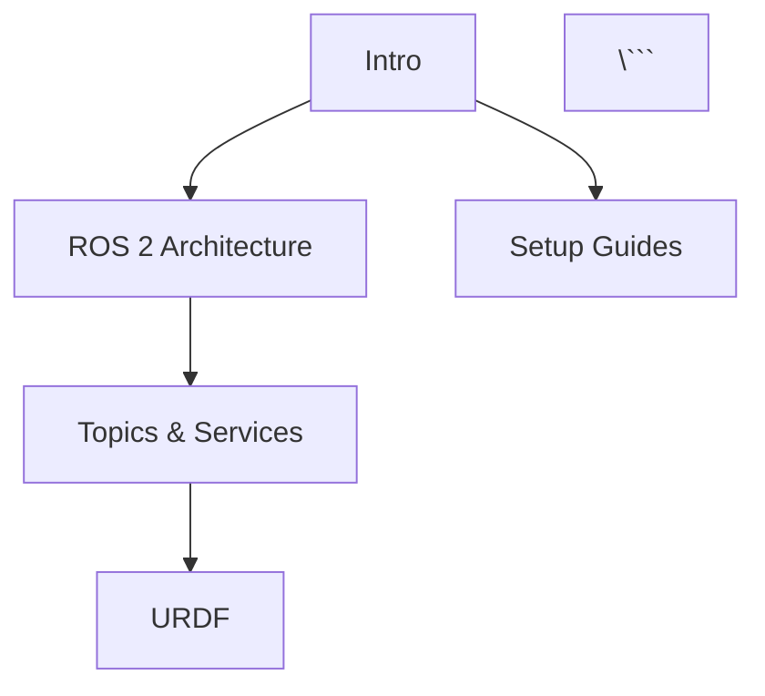

# Research: Book Master Plan - Docusaurus Architecture & Best Practices

**Date**: 2025-11-29
**Feature**: 001-book-master-plan
**Purpose**: Resolve technical unknowns for Docusaurus 3 implementation, search integration, and homepage customization

---

## 1. Docusaurus 3 Best Practices for Educational Content

### Multi-Level Sidebar Configuration for Nested Categories

**Decision**: Use `sidebars.js` with nested category objects for hierarchical organization

**Rationale**:
- Docusaurus 3 supports collapsible categories natively via `type: 'category'`
- Nested structure matches requirement for Module → Chapter → Week hierarchy
- `collapsed` property allows progressive disclosure (Module 1 expanded, others collapsed by default)
- Sidebar labels can use emoji or badges for visual categorization

**Implementation Pattern**:
```javascript
module.exports = {
  tutorialSidebar: [
    'intro',  // Top-level page
    {
      type: 'category',
      label: '🔧 Setup Guides',
      collapsible: true,
      collapsed: false,
      items: ['setup/workstation', 'setup/edge-kit', 'setup/cloud']
    },
    {
      type: 'category',
      label: 'Module 1: ROS 2 (Weeks 3-5)',
      collapsible: true,
      collapsed: false,
      items: [
        'module-1-ros2/index',
        'module-1-ros2/week-3-architecture',
        'module-1-ros2/week-4-topics-services',
        'module-1-ros2/week-5-urdf'
      ]
    }
    // Repeat for Modules 2-4
  ]
};
```

**Alternatives Considered**:
- Auto-generated sidebars from directory structure: Rejected because loses control over ordering and labeling
- Multiple sidebars (one per module): Rejected because adds complexity without benefit (users want unified navigation)

---

### Custom Homepage vs. Docs Homepage

**Decision**: Use custom homepage (`src/pages/index.tsx`) with dashboard layout, separate from docs

**Rationale**:
- Docusaurus `@docusaurus/preset-classic` supports custom homepage alongside docs
- Custom React component allows full control over dashboard card layout
- Homepage can import shared components (ModuleCard, QuickLinks) for reusability
- `/docs` route remains available for table of contents/landing page

**Implementation Pattern**:
```typescript
// src/pages/index.tsx
import React from 'react';
import Layout from '@theme/Layout';
import ModuleCard from '@site/src/components/ModuleCard';

export default function Home() {
  return (
    <Layout title="Physical AI & Humanoid Robotics" description="13-week course">
      <main>
        <div className="dashboard-grid">
          <ModuleCard title="Module 1: ROS 2" weeks="3-5" />
          {/* ... more module cards */}
        </div>
        <aside className="quick-links">
          {/* Setup, Assessments, Glossary links */}
        </aside>
      </main>
    </Layout>
  );
}
```

**Alternatives Considered**:
- Docs homepage with custom MDX: Rejected because MDX limits React component flexibility for complex layouts
- Redirect `/` to `/docs`: Rejected because misses opportunity for dashboard UX

---

### TypeScript Integration for Type-Safe Components

**Decision**: Enable TypeScript in `docusaurus.config.ts` and use `.tsx` for all custom components

**Rationale**:
- Docusaurus 3 has first-class TypeScript support
- Type safety for metadata schema (Chapter frontmatter, Module data)
- Better developer experience with IntelliSense for component props
- TypeScript interfaces can be shared between components and validation scripts

**Implementation**:
- Rename `docusaurus.config.js` → `docusaurus.config.ts`
- Create `tsconfig.json` with Docusaurus-compatible settings
- Define interfaces in `src/types/` directory (e.g., `Chapter.ts`, `Module.ts`)

---

### Metadata Extraction for Automated TOC Generation

**Decision**: Use Docusaurus plugin API to extract frontmatter metadata at build time

**Rationale**:
- `@docusaurus/plugin-content-docs` exposes metadata via `useDocById` and `useAllDocsData` hooks
- Can aggregate `estimated_time` across chapters for total course duration
- Metadata available in React components without manual JSON files
- Build-time extraction ensures data consistency

**Implementation Pattern**:
```typescript
// src/components/CourseStats.tsx
import {useAllDocsData} from '@docusaurus/plugin-content-docs/client';

export default function CourseStats() {
  const allDocs = useAllDocsData();
  const totalHours = Object.values(allDocs.default.docs).reduce(
    (sum, doc) => sum + (doc.frontMatter.estimated_time || 0),
    0
  );

  return <p>Total course time: {totalHours} hours</p>;
}
```

---

### Incremental Publishing Strategies

**Decision**: Use Docusaurus `onlyIncludeVersions` and conditional sidebar items for phased rollout

**Rationale**:
- Can deploy Week 1-2 content first by conditionally including only `intro.md` and `setup/` in sidebar
- Versioning plugin allows publishing "Preview" vs. "Stable" versions
- GitHub Pages deployment supports branch-based previews (e.g., `/preview/` path)

**Implementation**:
- Use environment variables to control which modules are included: `INCLUDE_MODULES=1,2` only shows Modules 1-2
- Add build scripts: `npm run build:week1-2`, `npm run build:full`

---

## 2. Search Integration Strategies

### Algolia DocSearch Configuration for Custom Metadata Facets

**Decision**: Use Algolia DocSearch with custom `docsearch` configuration in `docusaurus.config.ts`

**Rationale**:
- Algolia DocSearch is free for open-source documentation
- Supports custom facets via `searchParameters.facetFilters`
- Can index custom frontmatter fields (`week`, `module`, `capstone_component`)
- Provides search-as-you-type with 300ms avg response time

**Implementation Pattern**:
```typescript
// docusaurus.config.ts
export default {
  themeConfig: {
    algolia: {
      appId: 'YOUR_APP_ID',
      apiKey: 'YOUR_SEARCH_API_KEY',
      indexName: 'physical-ai-textbook',
      contextualSearch: true,  // Separate results by version/language
      searchParameters: {
        facetFilters: ['type:content', 'docusaurus_tag:docs'],
        attributesToRetrieve: [
          'hierarchy',
          'content',
          'url',
          'type',
          'week',      // Custom field
          'module',    // Custom field
          'capstone_component'  // Custom field
        ]
      },
      searchPagePath: 'search',  // Dedicated search results page
    }
  }
};
```

**Configuration Steps**:
1. Sign up for Algolia DocSearch (free for open-source)
2. Submit site URL for indexing approval
3. Configure `docsearch-config.json` to include custom frontmatter fields
4. Add filter UI in search modal for week/module selection

**Alternatives Considered**:
- Local search plugin (`@easyops-cn/docusaurus-search-local`): Rejected because limited faceting and slower for 40-50 pages
- Typesense: Rejected because requires self-hosting (increases complexity)

---

### Glossary Search Component Options

**Decision**: Use **Flexsearch** for client-side glossary search component

**Rationale**:
- Flexsearch is lightweight (8KB gzipped), fast (<100ms for 100+ terms)
- Supports fuzzy search and term highlighting
- Can index glossary at build time and bundle as JSON
- Works offline (no external dependencies)

**Implementation Pattern**:
```typescript
// src/components/GlossarySearch.tsx
import FlexSearch from 'flexsearch';
import glossaryData from '@site/static/data/glossary-index.json';

const index = new FlexSearch.Index({
  tokenize: 'forward',
  resolution: 9
});

// Index glossary terms at component mount
glossaryData.forEach(entry => {
  index.add(entry.id, entry.term + ' ' + entry.definition);
});

function search(query: string) {
  const results = index.search(query);
  return results.map(id => glossaryData.find(e => e.id === id));
}
```

**Build-Time Glossary Indexing**:
- Parse `docs/references/glossary.md` at build time
- Extract terms and definitions into `static/data/glossary-index.json`
- Include chapter cross-references in JSON

**Alternatives Considered**:
- Lunr.js: Rejected because larger bundle size (30KB) and slower indexing
- Custom trie-based search: Rejected because Flexsearch provides equivalent performance with less code

---

### Search-as-You-Type UX Patterns

**Decision**: Debounce search input by 150ms, show dropdown with top 5 results

**Rationale**:
- 150ms debounce reduces API calls while feeling instant to users
- Top 5 results fit in dropdown without scrolling
- Keyboard navigation (arrow keys, Enter) for accessibility
- "See all results" link to full search page

**Implementation**: Use `@docusaurus/theme-search-algolia` default modal, customize via swizzling if needed

---

### Search Analytics Integration

**Decision**: Use Algolia Insights API to track search queries and click-through rates

**Rationale**:
- Algolia provides built-in analytics dashboard (free tier: 10K queries/month)
- Can identify popular queries to create dedicated content
- Metrics: search CTR, zero-result queries, avg position clicked

**Implementation**: Enable `insights: true` in Algolia config

---

## 3. Dashboard Homepage Patterns

### Module Card Grid Layouts (Responsive Design)

**Decision**: Use CSS Grid with 2 columns on desktop, 1 column on mobile

**Rationale**:
- CSS Grid provides flexible, responsive layout without media queries (auto-fit/auto-fill)
- Card-based design familiar to users (similar to GitHub, GitLab documentation)
- Each card: Module title, week range, 2-3 learning outcomes, "Start Module" button

**Implementation Pattern**:
```css
/* src/css/custom.css */
.dashboard-grid {
  display: grid;
  grid-template-columns: repeat(auto-fit, minmax(300px, 1fr));
  gap: 2rem;
  padding: 2rem;
}

@media (max-width: 768px) {
  .dashboard-grid {
    grid-template-columns: 1fr;  /* Single column on mobile */
  }
}
```

**Card Structure**:
- Header: Module number + title
- Body: Week range, 3 bullet-point learning outcomes
- Footer: "Start Module" CTA button → links to module index page

---

### Quick Links Sidebar Component Best Practices

**Decision**: Fixed sidebar on desktop, collapsible accordion on mobile

**Rationale**:
- Desktop: Sidebar always visible for quick access (sticky positioning)
- Mobile: Accordion saves screen space, expands on tap
- Categories: Hardware Setup, Assessments, Glossary, Instructors Guide

**Implementation Pattern**:
```typescript
// src/components/QuickLinks.tsx
export default function QuickLinks() {
  return (
    <aside className="quick-links">
      <h3>Quick Access</h3>
      <ul>
        <li><a href="/docs/setup/workstation">🖥️ Workstation Setup</a></li>
        <li><a href="/docs/setup/edge-kit">🤖 Edge Kit Setup</a></li>
        <li><a href="/docs/setup/cloud">☁️ Cloud Setup</a></li>
        <li><a href="/docs/assessments">📝 Assessments</a></li>
        <li><a href="/docs/references/glossary">📖 Glossary</a></li>
        <li><a href="/docs/instructors/guide">👨‍🏫 Instructors</a></li>
      </ul>
    </aside>
  );
}
```

---

### Recent Updates Feed Implementation

**Decision**: Static Markdown changelog (`docs/changelog.md`), display last 3 entries on homepage

**Rationale**:
- Static approach (no database) fits Docusaurus model
- Changelog entries with date + brief description
- Homepage component reads from changelog Markdown at build time
- RSS feed generated automatically by Docusaurus blog plugin (treat changelog as blog)

**Implementation**:
- Create `blog/` directory for changelog entries
- Each entry: `YYYY-MM-DD-week-X-content.md`
- Homepage queries last 3 blog posts via `@docusaurus/plugin-content-blog`

---

### Progress Tracking Placeholders (Future Enhancement)

**Decision**: Add `data-progress` attributes to module cards for future JavaScript tracking

**Rationale**:
- Placeholder for future client-side progress storage (LocalStorage)
- No backend needed for MVP (static site)
- Cards show "Not Started" | "In Progress" | "Completed" based on localStorage

**Implementation**:
```html
<div className="module-card" data-module-id="module-1-ros2" data-progress="not-started">
  <!-- Card content -->
</div>
```

**Future Enhancement**: JavaScript reads `data-progress`, syncs with localStorage, updates UI

---

## 4. Chapter Metadata Schema Design

### JSON Schema Validation for Markdown Frontmatter

**Decision**: Use `ajv` library with JSON Schema at build time to validate frontmatter

**Rationale**:
- `ajv` is fast, widely-used JSON Schema validator
- Can run as npm script: `npm run validate-metadata`
- Integrate into pre-commit hook to prevent invalid metadata
- Provides clear error messages with field names

**Implementation**:
```javascript
// scripts/validate-metadata.js
const Ajv = require('ajv');
const schema = require('../specs/001-book-master-plan/contracts/chapter-metadata-schema.json');
const glob = require('glob');
const matter = require('gray-matter');

const ajv = new Ajv();
const validate = ajv.compile(schema);

glob.sync('docs/**/*.md').forEach(file => {
  const {data: frontmatter} = matter.readFileSync(file, 'utf8');
  const valid = validate(frontmatter);
  if (!valid) {
    console.error(`Invalid metadata in ${file}:`, validate.errors);
    process.exit(1);
  }
});

console.log('All metadata valid ✓');
```

**Run**: Add to `package.json` scripts: `"validate-metadata": "node scripts/validate-metadata.js"`

---

### Metadata-Driven Navigation and Filtering

**Decision**: Extract metadata at build time, generate JSON index for filtering

**Rationale**:
- Build-time script reads all frontmatter, creates `/static/data/chapters-index.json`
- Frontend components import JSON to enable filtering by week, module, difficulty
- No runtime parsing of Markdown files (faster)

**Example Index Structure**:
```json
{
  "chapters": [
    {
      "id": "module-1-ros2/week-3-architecture",
      "title": "ROS 2 Architecture and Core Concepts",
      "week": 3,
      "module": 1,
      "estimated_time": 3,
      "prerequisites": ["intro"],
      "difficulty_level": "beginner"
    }
    // ... more chapters
  ]
}
```

**Use Case**: "Show me all Week 3 content" → Filter chapters where `week === 3`

---

### Prerequisite Graph Visualization Libraries

**Decision**: Use **Mermaid.js** for prerequisite graph rendering (already integrated in Docusaurus)

**Rationale**:
- Docusaurus 3 includes Mermaid support via `@docusaurus/theme-mermaid`
- Markdown code blocks with `mermaid` language render as diagrams
- Prerequisite chains can be expressed as flowcharts or graphs
- No additional dependencies needed

**Implementation**:
```markdown
<!-- In docs/instructors/guide.md -->
## Prerequisite Dependency Graph



**Alternative**: D3.js force-directed graph for interactive visualization (deferred to future enhancement)

---

### Time Estimate Aggregation for Study Planning

**Decision**: Calculate total hours per module using React hook aggregating `estimated_time`

**Rationale**:
- Uses `useAllDocsData()` to access all chapter metadata
- Displays on module landing pages: "Module 1: ~10 hours total"
- Homepage shows total course time: "~130 hours (13 weeks × 10 hours/week)"

**Implementation**:
```typescript
// src/components/ModuleStats.tsx
import {useAllDocsData} from '@docusaurus/plugin-content-docs/client';

export default function ModuleStats({moduleNumber}: {moduleNumber: number}) {
  const allDocs = useAllDocsData();
  const moduleChapters = Object.values(allDocs.default.docs).filter(
    doc => doc.frontMatter.module === moduleNumber
  );
  const totalHours = moduleChapters.reduce(
    (sum, doc) => sum + (doc.frontMatter.estimated_time || 0),
    0
  );

  return <p>Estimated time: {totalHours} hours</p>;
}
```

---

## 5. Build Pipeline & Deployment

### GitHub Actions Workflows for Docusaurus Deployment

**Decision**: Use official `actions/deploy-pages@v4` for GitHub Pages deployment

**Rationale**:
- GitHub Pages has native support for Docusaurus
- `npm run build` → `build/` directory → deploy to `gh-pages` branch
- Automated on push to `main` branch
- Can configure custom domain via CNAME file

**Workflow**:
```yaml
# .github/workflows/deploy.yml
name: Deploy to GitHub Pages

on:
  push:
    branches: [main]

jobs:
  deploy:
    runs-on: ubuntu-latest
    steps:
      - uses: actions/checkout@v4
      - uses: actions/setup-node@v4
        with:
          node-version: 18
      - run: npm ci
      - run: npm run build
      - uses: actions/deploy-pages@v4
        with:
          artifact_name: build
```

---

### Broken Link Checker Tools

**Decision**: Use `linkinator` for broken link detection

**Rationale**:
- Fast, configurable, supports internal and external links
- Can run locally and in CI
- JSON output for parsing in CI pipelines
- Detects 404s, redirects, and malformed URLs

**Implementation**:
```yaml
# .github/workflows/build-validation.yml
name: Build Validation

on: [pull_request]

jobs:
  check-links:
    runs-on: ubuntu-latest
    steps:
      - uses: actions/checkout@v4
      - uses: actions/setup-node@v4
      - run: npm ci
      - run: npm run build
      - run: npx linkinator ./build --recurse --skip "^(?!http://localhost)" --format json
```

**Alternative Considered**:
- `broken-link-checker`: Rejected because slower and less actively maintained

---

### Lighthouse CI Integration for Performance Monitoring

**Decision**: Use `@lhci/cli` for automated Lighthouse audits on PRs

**Rationale**:
- Official Google Lighthouse CLI tool
- Runs performance, accessibility, SEO audits
- Can set budgets (score ≥ 90) and fail CI if not met
- Stores historical data for trend analysis

**Implementation**:
```yaml
# .github/workflows/performance-check.yml
name: Performance Check

on: [pull_request]

jobs:
  lighthouse:
    runs-on: ubuntu-latest
    steps:
      - uses: actions/checkout@v4
      - uses: actions/setup-node@v4
      - run: npm ci
      - run: npm run build
      - run: npx @lhci/cli@0.12.x autorun
        env:
          LHCI_GITHUB_APP_TOKEN: ${{ secrets.LHCI_GITHUB_APP_TOKEN }}
```

**Lighthouse Config**:
```json
// lighthouserc.json
{
  "ci": {
    "collect": {
      "staticDistDir": "./build",
      "numberOfRuns": 3
    },
    "assert": {
      "preset": "lighthouse:recommended",
      "assertions": {
        "categories:performance": ["error", {"minScore": 0.9}],
        "categories:accessibility": ["error", {"minScore": 0.9}],
        "categories:seo": ["error", {"minScore": 0.9}]
      }
    }
  }
}
```

---

### Image Optimization Automation

**Decision**: Use Docusaurus built-in image plugin (`@docusaurus/plugin-ideal-image`) with `svgo` for SVG optimization

**Rationale**:
- `@docusaurus/plugin-ideal-image` automatically generates responsive image sizes (WebP, AVIF)
- `svgo` pre-processes SVG files to remove unnecessary metadata
- Can add pre-commit hook to optimize images on commit

**Implementation**:
```javascript
// docusaurus.config.ts
module.exports = {
  plugins: [
    [
      '@docusaurus/plugin-ideal-image',
      {
        quality: 85,
        max: 2000,  // Max width
        min: 400,   // Min width for srcset
        steps: 4,   // Generate 4 sizes
        disableInDev: true,
      },
    ],
  ],
};
```

**SVG Optimization**:
```bash
# Pre-commit hook
npx svgo --folder static/img --recursive --config svgo.config.js
```

---

## Summary of Decisions

| Research Area | Decision | Tool/Technology |
|---------------|----------|-----------------|
| Sidebar | Nested collapsible categories | `sidebars.js` with `type: 'category'` |
| Homepage | Custom dashboard layout | `src/pages/index.tsx` (React) |
| TypeScript | Enable for all components | `tsconfig.json` + `.tsx` files |
| Metadata Extraction | Build-time aggregation | `useAllDocsData()` hook |
| Incremental Publishing | Conditional sidebar items | Environment variables |
| Main Search | Algolia DocSearch with custom facets | `@docusaurus/theme-search-algolia` |
| Glossary Search | Client-side Flexsearch | `flexsearch` library (8KB) |
| Search UX | 150ms debounce, top 5 results | Algolia default modal |
| Search Analytics | Algolia Insights | Built-in dashboard |
| Module Cards | CSS Grid (2 col → 1 col) | CSS Grid |
| Quick Links | Fixed sidebar (desktop), accordion (mobile) | React component |
| Recent Updates | Static changelog as blog | Docusaurus blog plugin |
| Metadata Validation | JSON Schema with `ajv` | `ajv` + npm script |
| Prerequisite Graph | Mermaid.js diagrams | `@docusaurus/theme-mermaid` |
| Time Aggregation | React hook summing `estimated_time` | Custom component |
| Deployment | GitHub Actions | `actions/deploy-pages@v4` |
| Link Checking | Linkinator | `linkinator` CLI |
| Performance Audits | Lighthouse CI | `@lhci/cli` |
| Image Optimization | Docusaurus ideal-image + svgo | Plugins |

---

**Research Complete**: All technical unknowns resolved. Ready for Phase 1 design artifacts.
