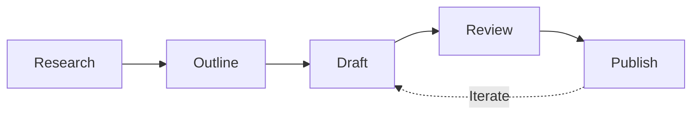
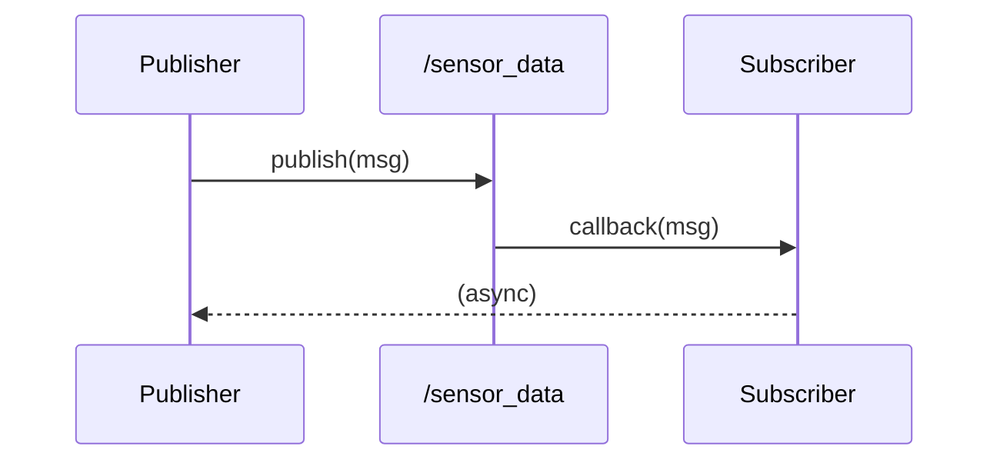
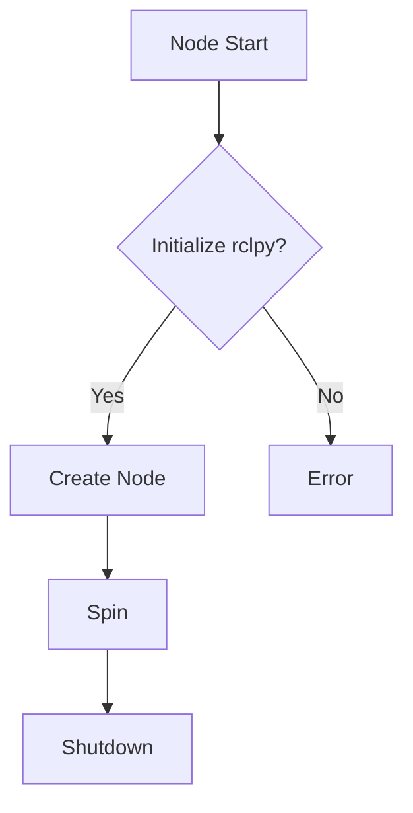

# Phase 1: Chapter Authoring Guide (Quickstart)

**Feature**: 005-module-1-ros2-chapters
**Date**: 2025-12-02
**Status**: Phase 1 In Progress

This guide provides step-by-step instructions for authors creating Module 1 ROS 2 chapter content.

---

## 1. Chapter Writing Workflow

### 1.1 Five-Phase Authoring Process



**Phase 1: Research** (2-4 hours)
- [ ] Read official ROS 2 Humble documentation for chapter topic
- [ ] Review related tutorials at docs.ros.org/en/humble/Tutorials.html
- [ ] Test all code examples locally on Ubuntu 22.04 + ROS 2 Humble
- [ ] Identify 2-3 key diagrams needed
- [ ] Note prerequisite knowledge from previous chapters

**Phase 2: Outline** (1-2 hours)
- [ ] List 3-5 major sections (H2 headings)
- [ ] For each section, list 2-4 subsections (H3 headings)
- [ ] Identify where code examples, diagrams, and exercises fit
- [ ] Draft learning objectives (2-5 objectives using Bloom's verbs)
- [ ] Estimate completion time (sum of section times, round to nearest 5 min)

**Phase 3: Draft** (8-12 hours)
- [ ] Copy `docs/_templates/tutorial.mdx` (or appropriate template)
- [ ] Fill front matter with metadata (see data-model.md Section 2)
- [ ] Write introduction (what + why, 1-2 paragraphs)
- [ ] Write each section following "Concept → Example → Exercise" pattern
- [ ] Embed code examples using `<CodeExample>` component
- [ ] Create exercises using `<ExerciseBlock>` component
- [ ] Add diagrams (Mermaid.js inline or SVG from `static/img/module-1/diagrams/`)
- [ ] Write key takeaways section

**Phase 4: Review** (2-3 hours)
- [ ] Run `npm run validate-metadata` to check front matter
- [ ] Run `npm run build` to verify MDX syntax
- [ ] Test all code examples (copy/paste and run locally)
- [ ] Check accessibility (alt text, heading hierarchy, contrast)
- [ ] Peer review (share draft with another author/instructor)
- [ ] Address review comments

**Phase 5: Publish** (30 min)
- [ ] Create feature branch: `git checkout -b 005-chapter-X-name`
- [ ] Commit chapter file: `git add docs/module-1-ros2/chapter-X-name.mdx`
- [ ] Commit code examples: `git add static/code-examples/module-1/`
- [ ] Commit diagrams: `git add static/img/module-1/diagrams/`
- [ ] Push and create PR: `gh pr create --title "Chapter X: Name"`
- [ ] Address CI/CD feedback (build errors, broken links)
- [ ] Merge after approval

---

## 2. Naming Conventions

### 2.1 File Names

| File Type | Convention | Example | Notes |
|-----------|------------|---------|-------|
| **Chapter MDX** | `chapter-X-slug.mdx` | `chapter-3-python-rclpy.mdx` | X = chapter number (1-5), slug = kebab-case |
| **Code (Complete)** | `chapterX_name.py` | `chapter3_minimal_publisher.py` | X = chapter number, snake_case name |
| **Code (Skeleton)** | `chapterX_name_skeleton.py` | `chapter3_minimal_publisher_skeleton.py` | Append `_skeleton` suffix |
| **URDF** | `chapterX_robot_name.urdf` | `chapter4_humanoid_arm.urdf` | XML file extension |
| **Launch File** | `chapterX_name_launch.py` | `chapter5_multi_node_launch.py` | Append `_launch` suffix |
| **Diagram (SVG)** | `slug-name.svg` | `node-topic-communication.svg` | kebab-case, descriptive |
| **Diagram Source** | `slug-name.drawio` | `node-topic-communication.drawio` | Same basename as SVG |

### 2.2 Heading Styles

**Chapter Title** (H1, once per file):
```mdx
# {frontMatter.title}
```
✅ Good: `# Chapter 2: ROS 2 Nodes and Topics`
❌ Bad: `# ROS 2 Nodes and Topics` (missing chapter number)

**Section Headings** (H2, major concepts):
```markdown
## 2.1 Understanding Nodes
```
✅ Good: Numbered, concise, starts with present participle or noun
❌ Bad: `## Nodes` (too vague), `## Let's Learn About Nodes!` (informal)

**Subsection Headings** (H3, sub-concepts):
```markdown
### 2.1.1 Node Lifecycle
```
✅ Good: Numbered hierarchically, specific
❌ Bad: `### Lifecycle` (needs context)

**Avoid H4** — If you need H4, your section is too complex. Refactor into multiple H2/H3 sections.

### 2.3 Code Example IDs

**In MDX** (when using `<CodeExample>` component):
```mdx
<CodeExample
  id="chapter3-minimal-publisher"  // Unique ID for linking
  filename="chapter3_minimal_publisher.py"
  ...
>
```

**Pattern**: `chapterX-slug-name` (kebab-case, no file extension)

### 2.4 Exercise IDs

**In MDX** (when using `<ExerciseBlock>` component):
```mdx
<ExerciseBlock
  id="chapter3-exercise-temperature-monitor"
  title="Build a Temperature Monitor"
  ...
>
```

**Pattern**: `chapterX-exercise-slug-name`

---

## 3. MDX Component Usage Patterns

### 3.1 Required Components (Every Chapter)

**LearningObjectives** (display at start):
```mdx
import LearningObjectives from '@site/src/components/LearningObjectives';

<LearningObjectives objectives={frontMatter.learning_objectives} />
```
- ✅ Always place immediately after imports
- ✅ Pass `frontMatter.learning_objectives` (auto-populated from front matter)

**Prerequisites** (display after LearningObjectives):
```mdx
import Prerequisites from '@site/src/components/Prerequisites';

<Prerequisites
  prereqs={frontMatter.prerequisites}
  estimatedTime={frontMatter.estimated_time}
/>
```
- ✅ Shows prerequisite chapters as links
- ✅ Displays estimated completion time

### 3.2 CodeExample Component

**Basic Usage** (skeleton code only):
```mdx
import CodeExample from '@site/src/components/learning/CodeExample';

<CodeExample
  language="python"
  filename="chapter3_minimal_publisher.py"
  showLineNumbers={true}
>
{`#!/usr/bin/env python3
import rclpy
from rclpy.node import Node

class MinimalPublisher(Node):
    def __init__(self):
        super().__init__('minimal_publisher')
        # TODO: Create publisher here
`}
</CodeExample>
```

**Advanced Usage** (with solution toggle):
```mdx
<CodeExample
  language="python"
  filename="chapter3_minimal_publisher.py"
  difficulty="beginner"
  estimatedTime={15}
  showLineNumbers={true}
  highlightLines={[8, 12-15]}
  solutionCode={require('!!raw-loader!@site/static/code-examples/module-1/complete/chapter3_minimal_publisher.py').default}
>
{require('!!raw-loader!@site/static/code-examples/module-1/skeleton/chapter3_minimal_publisher_skeleton.py').default}
</CodeExample>
```

**When to Use**:
- ✅ Code examples > 10 lines
- ✅ When skeleton + solution versions exist
- ✅ When you want to highlight specific lines

**When NOT to Use**:
- ❌ Inline snippets < 10 lines → Use markdown code blocks:
  ```python
  node = rclpy.create_node('my_node')
  ```
- ❌ Terminal commands → Use bash code blocks with `$` prompt:
  ```bash
  $ ros2 topic list
  /parameter_events
  /rosout
  ```

### 3.3 ExerciseBlock Component

**Usage**:
```mdx
import ExerciseBlock from '@site/src/components/learning/ExerciseBlock';

<ExerciseBlock
  title="Build a Multi-Node System"
  difficulty="intermediate"
  estimatedTime={45}
  type="guided"
  objectives={[
    "Create a publisher node",
    "Create a subscriber node",
    "Launch both nodes together"
  ]}
  hints={[
    "Use rclpy.create_node() to instantiate nodes",
    "Test with ros2 topic echo before implementing subscriber"
  ]}
  starterCode="chapter3_multi_node_skeleton.py"
  solutionCode="chapter3_multi_node_complete.py"
>

## Problem Statement
You are building a sensor monitoring system...

## Requirements
1. **Publisher Node**:
   - Publishes to `/sensor_data` topic
   - Message type: `std_msgs/msg/String`

2. **Subscriber Node**:
   - Subscribes to `/sensor_data`
   - Logs messages to console

## Getting Started
Download the starter code:
\`\`\`bash
wget https://example.com/chapter3_multi_node_skeleton.py
\`\`\`

## Testing
\`\`\`bash
# Terminal 1: Run publisher
python3 publisher.py

# Terminal 2: Run subscriber
python3 subscriber.py
\`\`\`

</ExerciseBlock>
```

**When to Use**:
- ✅ Hands-on practice exercises (15+ min)
- ✅ Multi-step guided activities
- ✅ When solution code is provided

**When NOT to Use**:
- ❌ Quick "try this" tasks (< 5 min) → Use callouts:
  ```mdx
  :::tip Try It
  Run `ros2 topic list` to see available topics.
  :::
  ```

### 3.4 ConceptCallout Component

**Usage**:
```mdx
import ConceptCallout from '@site/src/components/learning/ConceptCallout';

<ConceptCallout type="definition" title="What is a Node?">
A **node** is an independent process that performs computation in a ROS 2 system. Nodes communicate via topics, services, and actions.
</ConceptCallout>
```

**Types**:
- `type="definition"` — Define key terms (blue background)
- `type="concept"` — Explain important concepts (green background)
- `type="tip"` — Provide helpful hints (yellow background)
- `type="warning"` — Warn about pitfalls (orange background)
- `type="danger"` — Critical information (red background)

**When to Use**:
- ✅ Define new ROS 2 terminology
- ✅ Highlight conceptual insights
- ✅ Provide Python-specific tips

**When NOT to Use**:
- ❌ General information → Use standard Docusaurus admonitions:
  ```mdx
  :::info
  ROS 2 Humble is an LTS release supported until 2027.
  :::
  ```

### 3.5 Mermaid.js Diagrams

**Sequence Diagram Example**:
````mdx

````

**Flowchart Example**:
````mdx

````

**When to Use Mermaid.js**:
- ✅ Sequence diagrams (message flow)
- ✅ Flowcharts (decision trees, algorithms)
- ✅ Simple architecture diagrams

**When to Use draw.io**:
- ✅ Complex architecture diagrams
- ✅ Robot joint hierarchies (URDF trees)
- ✅ Multi-layer system diagrams

---

## 4. Accessibility Guidelines

### 4.1 Alt Text for Images

**Diagrams** (SVG from `static/img/`):
```mdx

```

**Alt Text Rules**:
- ✅ Describe what the diagram shows, not "diagram of..."
- ✅ Be specific: "ROS 2 computation graph showing publisher, topic, and subscriber"
- ❌ Don't: "Image", "Diagram", "Figure 1" (screen readers announce it's an image)

**Decorative Images** (no alt text needed):
```mdx

```
- Use empty alt text `` for purely decorative images

### 4.2 Heading Hierarchy

**Correct** ✅:
```markdown
# Chapter 2: Nodes and Topics (H1)
## 2.1 Understanding Nodes (H2)
### 2.1.1 Node Lifecycle (H3)
## 2.2 Topics (H2)
```

**Incorrect** ❌:
```markdown
# Chapter 2: Nodes and Topics (H1)
### 2.1 Understanding Nodes (H3) ← Skipped H2!
```

**Rule**: Never skip heading levels. H1 → H2 → H3, never H1 → H3.

### 4.3 Link Text

**Descriptive Links** ✅:
```mdx
See the [official ROS 2 installation guide](https://docs.ros.org/en/humble/Installation.html) for detailed steps.
```

**Avoid Generic Links** ❌:
```mdx
Click [here](https://example.com) for more information.
```

**Rule**: Link text should make sense out of context. Screen readers navigate by links.

### 4.4 Color Contrast

**Code Syntax Highlighting** (handled by Prism.js):
- Use `prism-react-renderer` default theme (meets WCAG 2.1 AA)

**Custom Components** (CodeExample, ExerciseBlock):
- Ensure foreground/background contrast ratio ≥ 4.5:1
- Test with [WebAIM Contrast Checker](https://webaim.org/resources/contrastchecker/)

**Diagrams** (draw.io):
- Use ROS 2 brand colors:
  - Primary: `#22314E` (dark blue)
  - Accent: `#00AEEF` (light blue)
- Ensure text on colored backgrounds meets contrast requirements

### 4.5 Keyboard Navigation

**Interactive Components** (ExerciseBlock, CodeExample):
- All buttons must be keyboard accessible (Tab, Enter)
- "View Solution" toggle: Test with Tab + Enter (no mouse)

**Testing Checklist**:
- [ ] Tab through all interactive elements in order
- [ ] Enter/Space activates buttons
- [ ] Escape closes modals/toggles
- [ ] No keyboard traps (can Tab out of all elements)

---

## 5. Content Style Guide

### 5.1 Tone and Voice

**Target Audience**: AI/ML practitioners transitioning to robotics
- Assume Python proficiency
- Do NOT assume ROS or robotics experience
- Use active voice: "You will create a node" (not "A node will be created")
- Be concise: Aim for Flesch-Kincaid Grade Level 10-12

**Example (Good)**:
> In this chapter, you'll learn how ROS 2 nodes communicate using topics. By the end, you'll build a publisher-subscriber system that streams sensor data.

**Example (Too Formal)**:
> This chapter presents an exposition of the ROS 2 topic-based communication paradigm, culminating in the implementation of a publisher-subscriber architecture.

### 5.2 Terminology

**ROS 2-Specific Terms** (capitalize/format correctly):
- ✅ ROS 2 (not ROS2, ros2, or ROS 2.0)
- ✅ Humble Hawksbill (not humble, Humble, or HH)
- ✅ rclpy (not RclPy, RCLPY, or RCL_Py)
- ✅ DDS (not dds or Dds)
- ✅ QoS (not qos or Qos)
- ✅ URDF (not urdf or Urdf)
- ✅ `ros2 topic list` (code formatting for CLI commands)

**First Mention** (define in ConceptCallout):
> <ConceptCallout type="definition" title="Node">
> A **node** is an independent process that performs computation in a ROS 2 system.
> </ConceptCallout>

**Subsequent Mentions** (use plain text):
> Each node runs in its own process...

### 5.3 Code Comment Style

**Python Code Examples** (follow PEP 257 for docstrings):
```python
#!/usr/bin/env python3
"""
Brief description of what this script does.

ROS 2 Distribution: Humble
Language: Python 3.10+

Longer description explaining the purpose, usage, and key concepts.
"""

import rclpy
from rclpy.node import Node

class MinimalPublisher(Node):
    """ROS 2 node that publishes messages at a fixed rate."""

    def __init__(self):
        """Initialize the publisher node."""
        super().__init__('minimal_publisher')
        # Create publisher on 'topic' with queue size 10
        self.publisher_ = self.create_publisher(String, 'topic', 10)

    def timer_callback(self):
        """Called every 0.5 seconds to publish a message."""
        msg = String()
        msg.data = f'Hello World: {self.i}'
        self.publisher_.publish(msg)
```

**Comment Rules**:
- ✅ Docstrings for modules, classes, and functions
- ✅ Inline comments for non-obvious logic
- ❌ Don't comment obvious code: `# Increment i` before `self.i += 1`
- ✅ Explain WHY, not WHAT: `# Use RELIABLE QoS for mission-critical data` (not `# Set QoS to RELIABLE`)

### 5.4 Example Output Formatting

**Bash Commands with Output**:
```bash
$ ros2 topic list
/parameter_events
/rosout
/sensor_data
```

**Python Script Output**:
```
[INFO] [1638360123.456789] [minimal_publisher]: Publishing: 'Hello World: 0'
[INFO] [1638360123.956789] [minimal_publisher]: Publishing: 'Hello World: 1'
```

**Rule**: Use `$` prompt for bash, no prompt for output. Show timestamps for ROS 2 logs.

---

## 6. Testing Checklist

### 6.1 Pre-Commit Checklist

Before committing your chapter, verify:

**Metadata Validation**:
- [ ] Run `npm run validate-metadata` → All checks pass
- [ ] Front matter includes all required fields (see data-model.md Section 2)
- [ ] `learning_objectives` use Bloom's taxonomy verbs (Understand, Apply, etc.)
- [ ] `estimated_time` is a multiple of 5 (e.g., 30, 45, 60)

**Build Validation**:
- [ ] Run `npm run build` → No MDX syntax errors
- [ ] Run `npm start` → Chapter displays correctly in local preview
- [ ] All links work (no 404s for internal links)

**Code Example Testing**:
- [ ] All code examples run without errors on ROS 2 Humble / Ubuntu 22.04
- [ ] Skeleton code has clear TODO markers
- [ ] Complete code includes docstrings and comments
- [ ] Code follows PEP 8 (run `ruff check` on Python files)

**Accessibility Testing**:
- [ ] All images have descriptive alt text
- [ ] Heading hierarchy is correct (H1 → H2 → H3, no skips)
- [ ] Color contrast meets WCAG 2.1 AA (4.5:1 for text)
- [ ] Keyboard navigation works (Tab through interactive elements)

**Content Review**:
- [ ] Chapter follows "Concept → Example → Exercise" pattern
- [ ] Tone is appropriate for AI/ML practitioners (not too formal, not too casual)
- [ ] ROS 2 terminology is used correctly (see Section 5.2)
- [ ] No placeholder text (e.g., [TODO], [FIXME]) remains

### 6.2 Peer Review Checklist

When reviewing another author's chapter:

**Content Accuracy**:
- [ ] Technical information is correct (verify against official ROS 2 docs)
- [ ] Code examples run successfully (test locally)
- [ ] Diagrams accurately represent concepts

**Educational Quality**:
- [ ] Learning objectives are measurable and aligned with content
- [ ] Prerequisites are appropriate (not too advanced, not redundant)
- [ ] Exercises are challenging but achievable
- [ ] Key takeaways summarize main concepts

**Consistency**:
- [ ] Follows naming conventions (Section 2)
- [ ] Uses components correctly (Section 3)
- [ ] Matches tone/style of other chapters (Section 5)

**Feedback Format**:
```markdown
## Chapter 3 Review

### Strengths
- Excellent explanation of rclpy callback execution model
- Code examples are clear and well-documented

### Issues
1. **Section 3.2**: Missing QoS explanation before code example
   - Suggestion: Add ConceptCallout defining QoS policies
2. **Exercise 3.1**: Skeleton code has syntax error on line 12
   - Fix: Change `create_publisher` to `self.create_publisher`

### Accessibility
- Missing alt text for diagram in Section 3.1
- Heading hierarchy skips H2 in Section 3.3

### Overall
Approve after addressing issues 1-2 and accessibility items.
```

---

## 7. Common Pitfalls and Solutions

### 7.1 MDX Syntax Errors

**Problem**: MDX fails to parse
```
Error: Expected corresponding JSX closing tag for <CodeExample>
```

**Solution**: Always wrap JSX components in blank lines
```mdx
Paragraph of text.

<CodeExample ...>
...
</CodeExample>

Next paragraph.
```

**Problem**: "require is not defined"
```
ReferenceError: require is not defined
```

**Solution**: Use dynamic imports with `!!raw-loader!` prefix (see Section 3.2)

### 7.2 Component Prop Errors

**Problem**: Component doesn't render
```
Warning: Failed prop type: Invalid prop `objectives` of type `string` supplied to `LearningObjectives`, expected `array`.
```

**Solution**: Pass array from front matter, not string
```mdx
✅ <LearningObjectives objectives={frontMatter.learning_objectives} />
❌ <LearningObjectives objectives="Understand nodes" />
```

### 7.3 Code Example Issues

**Problem**: Code runs in isolation but not in chapter context

**Solution**: Ensure all imports are included in code block (don't assume reader's environment)
```python
# ✅ Include all imports
import rclpy
from rclpy.node import Node
from std_msgs.msg import String

# ❌ Don't assume imports
# (Assuming you've already imported rclpy...)
node = Node('my_node')
```

### 7.4 Diagram Rendering Issues

**Problem**: SVG diagram doesn't display

**Solution**: Check file path is relative to `static/` directory
```mdx
✅ 
❌ 
```

**Problem**: Mermaid.js diagram renders incorrectly

**Solution**: Validate syntax at [mermaid.live](https://mermaid.live/) before embedding

### 7.5 Performance Issues

**Problem**: Page loads slowly (>3 seconds)

**Causes**:
- Large images (>500KB)
- Too many inline code blocks (>20 per page)
- Complex Mermaid.js diagrams (>50 nodes)

**Solutions**:
- Optimize images: Use SVG (not PNG) for diagrams, compress PNG screenshots
- Split long chapters into multiple pages (if >3000 words)
- Use draw.io for complex diagrams (render to SVG offline)

---

## 8. Quick Reference

### 8.1 Chapter Anatomy

```mdx
---
# Front matter (see data-model.md Section 2)
title: "Chapter X: Title"
description: "..."
keywords: [...]
sidebar_position: X
learning_objectives:
  - Understand...
  - Apply...
prerequisites: [...]
estimated_time: 45
content_type: tutorial
difficulty: beginner
---

import LearningObjectives from '@site/src/components/LearningObjectives';
import Prerequisites from '@site/src/components/Prerequisites';
import CodeExample from '@site/src/components/learning/CodeExample';
import ExerciseBlock from '@site/src/components/learning/ExerciseBlock';

<LearningObjectives objectives={frontMatter.learning_objectives} />
<Prerequisites prereqs={frontMatter.prerequisites} estimatedTime={frontMatter.estimated_time} />

# {frontMatter.title}

## Introduction
What you'll learn and why it matters...

## X.1 First Major Concept
Explanation of concept...

### X.1.1 Subsection
Details and examples...

<CodeExample ...>
...
</CodeExample>

### X.1.2 Exercise
<ExerciseBlock ...>
...
</ExerciseBlock>

## X.2 Second Major Concept
...

## Key Takeaways
- Main point 1
- Main point 2
- Main point 3

## Next Steps
- [Next Chapter](./chapter-X+1-name)
- [Assessment X](../../assessments/module-1/assessment-X)
```

### 8.2 Essential Commands

| Task | Command |
|------|---------|
| Validate metadata | `npm run validate-metadata` |
| Build site | `npm run build` |
| Start dev server | `npm start` |
| Typecheck | `npm run typecheck` |
| Check links | `npm run check-links` (after build) |
| Lint Python code | `ruff check static/code-examples/module-1/complete/*.py` |
| Format Python code | `ruff format static/code-examples/module-1/complete/*.py` |

### 8.3 Helpful Links

- **ROS 2 Humble Docs**: [docs.ros.org/en/humble](https://docs.ros.org/en/humble/)
- **Docusaurus Docs**: [docusaurus.io/docs](https://docusaurus.io/docs)
- **MDX Playground**: [mdxjs.com/playground](https://mdxjs.com/playground/)
- **Mermaid Live Editor**: [mermaid.live](https://mermaid.live/)
- **WebAIM Contrast Checker**: [webaim.org/resources/contrastchecker](https://webaim.org/resources/contrastchecker/)

---

## 9. Getting Help

### 9.1 Ask for Help When...

- ✅ Unsure which template to use (concept vs. tutorial vs. reference)
- ✅ ROS 2 concept is unclear (consult official docs + team lead)
- ✅ MDX syntax error persists after consulting this guide
- ✅ Accessibility concern (e.g., complex diagram, how to make accessible?)
- ✅ Code example fails on ROS 2 Humble (may need environment fix)

### 9.2 Contact Points

- **Technical Questions**: Post in `#module-1-authors` Slack channel
- **Build/CI Issues**: Tag `@devops-team` in Slack
- **Content Review**: Request review from `@lead-instructor`
- **Urgent Issues**: Email `course-dev@example.com`

---

## 10. Appendix: Example Chapter (Annotated)

See `docs/_test-chapter-template.mdx` for a fully-annotated example chapter demonstrating all concepts in this guide.

---

## Phase 1 Checklist (Quickstart)

- [x] Define five-phase authoring workflow
- [x] Establish naming conventions (files, headings, IDs)
- [x] Document MDX component usage patterns
- [x] Specify accessibility guidelines
- [x] Create content style guide
- [x] Provide testing checklists
- [x] List common pitfalls and solutions
- [x] Create quick reference section

**Status**: Quickstart Complete ✅
**Next**: Create `contracts/` directory with component specifications

---

## References

- [Docusaurus Markdown Features](https://docusaurus.io/docs/markdown-features)
- [MDX Documentation](https://mdxjs.com/docs/)
- [WCAG 2.1 Guidelines](https://www.w3.org/WAI/WCAG21/quickref/)
- [PEP 257 — Docstring Conventions](https://peps.python.org/pep-0257/)
- [Bloom's Taxonomy Verbs](https://tips.uark.edu/using-blooms-taxonomy/)
