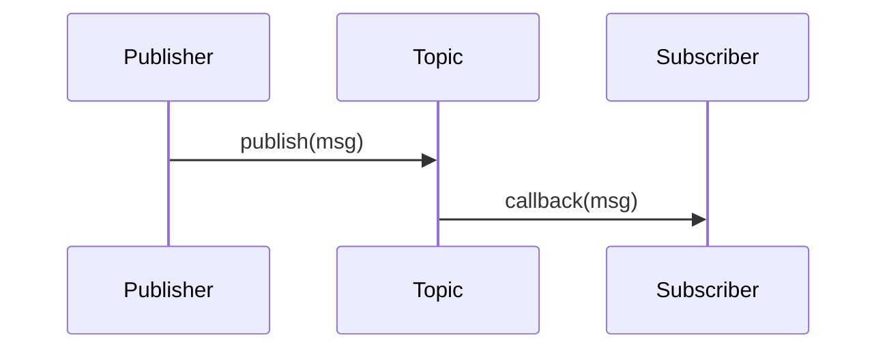

# Phase 0: Research and Discovery

**Feature**: 005-module-1-ros2-chapters
**Date**: 2025-12-02
**Status**: Phase 0 Complete

This document captures research findings and design decisions for creating Module 1 ROS 2 educational content.

---

## 1. Content Sources

### 1.1 ROS 2 Humble Official Documentation

**Primary Authoritative Sources**:

- **Main Documentation**: [ROS 2 Documentation — Humble](https://docs.ros.org/en/humble/index.html)
  - Comprehensive reference for ROS 2 Humble Hawksbill LTS
  - Installation guides for Ubuntu 22.04 (Jammy Jellyfish)
  - API references for rclpy, rclcpp, and core packages

- **Official Tutorials**: [Tutorials — Humble](https://docs.ros.org/en/humble/Tutorials.html)
  - "Step-by-step instructions meant to steadily build skills in ROS 2"
  - Best approached sequentially for first-time learners
  - Categories: Beginner (CLI tools), Intermediate (Client libraries), Advanced (Launch files)

- **Installation Guide**: [Installation — Humble](https://docs.ros.org/en/humble/Installation.html)
  - Binary packages for Ubuntu 22.04 LTS
  - Debian packages with `apt install ros-humble-desktop` recommended
  - Source build instructions for advanced users

**Key Tutorials to Reference**:

| Tutorial | URL Fragment | Relevant Chapter |
|----------|-------------|------------------|
| Configuring ROS 2 environment | `/Tutorials/Configuring-ROS2-Environment` | Chapter 1 |
| Understanding nodes | `/Tutorials/Understanding-ROS2-Nodes` | Chapter 2 |
| Understanding topics | `/Tutorials/Understanding-ROS2-Topics` | Chapter 2 |
| Writing a simple publisher/subscriber (Python) | `/Tutorials/Writing-A-Simple-Py-Publisher-And-Subscriber` | Chapter 3 |
| Writing a simple service/client (Python) | `/Tutorials/Writing-A-Simple-Py-Service-And-Client` | Chapter 3 |
| Using parameters in Python | `/Tutorials/Using-Parameters-In-A-Class-Python` | Chapter 3 |
| Understanding URDF | `/Tutorials/Intermediate/URDF/URDF-Main` | Chapter 4 |
| Creating a launch file | `/Tutorials/Launch-Files/Creating-Launch-Files` | Chapter 5 |
| Creating a package | `/Tutorials/Creating-A-Workspace/Creating-A-Package` | Chapter 5 |

### 1.2 Additional ROS 2 Educational Resources

**Complementary Resources** (to differentiate from):

- **ROS 2 Design**: [design.ros2.org](https://design.ros2.org/) — Architectural decisions and DDS middleware rationale
- **ROS Index**: [index.ros.org](https://index.ros.org/) — Package discovery and community contributions
- **ROS Discourse**: [discourse.ros.org](https://discourse.ros.org/) — Community Q&A and best practices
- **ROS Answers**: [answers.ros.org](https://answers.ros.org/) — Technical troubleshooting database

**Differentiation Strategy**:

Our content differs from official tutorials by:
1. **Physical AI context**: Explicitly connecting ROS 2 to humanoid robotics (official tutorials use TurtleSim)
2. **AI/ML practitioner audience**: Assuming Python/ML background, not assuming robotics experience
3. **Scaffolded code**: Providing skeleton code with TODOs (official tutorials give complete solutions)
4. **Interactive components**: Using MDX components (LearningObjectives, Prerequisites) for structured learning
5. **Capstone integration**: Tying each concept to the 13-week autonomous humanoid project

### 1.3 Technical Standards References

- **URDF XML Specification**: [wiki.ros.org/urdf/XML](http://wiki.ros.org/urdf/XML) — Joint/link element definitions
- **DDS QoS Policies**: [docs.ros.org QoS](https://docs.ros.org/en/humble/Concepts/About-Quality-of-Service-Settings.html) — Reliability, durability, liveliness
- **Python rclpy API**: [docs.ros2.org/humble/api/rclpy](https://docs.ros2.org/humble/api/rclpy/) — Node, Publisher, Subscription classes

---

## 2. Diagram Requirements

### 2.1 Diagram Inventory (by Chapter)

**Chapter 1: Introduction to ROS 2**
- `ros2-architecture.svg` — High-level architecture (Application → ROS 2 Client Library → DDS Middleware → OS/Transport)
- `dds-middleware-comparison.svg` — Comparison table: ROS 1 vs. ROS 2 vs. Traditional IPC
- `computation-graph-example.svg` — Simple 3-node graph (camera → perception → actuator)

**Chapter 2: ROS 2 Nodes and Topics**
- `node-topic-communication.svg` — Sequence diagram: Publisher → Topic → Subscriber
- `multiple-subscribers.svg` — 1 publisher, 3 subscribers (fan-out pattern)
- `qos-policy-diagram.svg` — Visual representation of Reliable vs. Best-Effort QoS
- `namespace-hierarchy.svg` — Node naming with namespaces (`/robot1/camera`, `/robot2/camera`)

**Chapter 3: Python Programming with rclpy**
- `rclpy-class-hierarchy.svg` — Node → Publisher/Subscription/Service/Client inheritance
- `callback-execution-flow.svg` — Event loop and callback queue visualization
- `timer-callback-diagram.svg` — Periodic timer execution with spin()
- `service-request-response.svg` — Synchronous service call sequence

**Chapter 4: URDF for Humanoid Robots**
- `urdf-hierarchy-tree.svg` — Humanoid robot link tree (base → torso → arms/head → hands)
- `joint-types-comparison.svg` — Visual comparison: revolute, prismatic, fixed, continuous
- `coordinate-frames.svg` — TF2 frames for humanoid (world → base_link → shoulder → elbow → wrist)
- `urdf-to-rviz-pipeline.svg` — URDF file → robot_state_publisher → TF2 → RViz2

**Chapter 5: Launch Files and Package Management**
- `package-structure.svg` — ROS 2 package directory tree (src/, launch/, config/, package.xml)
- `launch-file-execution.svg` — Launch file → Node spawning → Parameter loading
- `dependency-graph.svg` — Example multi-package dependency graph

### 2.2 Diagram Tooling Decision

**Recommendation: Hybrid Approach**

| Tool | Use Case | Format | Pros | Cons |
|------|----------|--------|------|------|
| **Mermaid.js** | Simple diagrams (flowcharts, sequence, class) | Inline MDX code | Version-controlled, editable in IDE, no binary blobs | Limited styling, no complex layouts |
| **draw.io (diagrams.net)** | Complex architecture diagrams | SVG export | Professional appearance, fine-grained control | Requires external editor, binary `.drawio` files |
| **Excalidraw** | Hand-drawn style diagrams | SVG export | Approachable aesthetic for learners | Less formal, harder to maintain consistency |

**Implementation Plan**:
1. Use **Mermaid.js** for all sequence diagrams and simple flowcharts (Chapters 2, 3)
2. Use **draw.io** for architecture diagrams and complex hierarchies (Chapters 1, 4)
3. Export draw.io diagrams as **SVG** (not PNG) for scalability
4. Store draw.io source files in `static/diagrams-src/module-1/*.drawio` for editability
5. Add diagram style guide in `quickstart.md` (colors: ROS 2 blue `#22314E`, accent `#00AEEF`)

**Mermaid.js Example (for sequence diagram)**:
```mdx

```

**No animated diagrams needed** — Static diagrams sufficient for ROS 2 concepts. Animation adds complexity without educational benefit.

---

## 3. Code Example Infrastructure

### 3.1 Skeleton Code Template Structure

**Decision: Minimal Scaffolding with TODO Markers**

Based on clarification session (2025-12-02), code examples will use skeleton structure:

**Complete Version** (instructor reference, in `static/code-examples/module-1/complete/`):
```python
#!/usr/bin/env python3
"""
Complete solution for [Exercise Name]

ROS 2 Humble | rclpy | Beginner

This script demonstrates [concept]. Students should implement
the TODOs in the skeleton version before referring to this solution.
"""

import rclpy
from rclpy.node import Node
from std_msgs.msg import String

class MinimalPublisher(Node):
    """ROS 2 node that publishes messages at fixed rate."""

    def __init__(self):
        super().__init__('minimal_publisher')
        self.publisher_ = self.create_publisher(String, 'topic', 10)
        self.timer = self.create_timer(0.5, self.timer_callback)
        self.i = 0

    def timer_callback(self):
        """Called every 0.5 seconds to publish message."""
        msg = String()
        msg.data = f'Hello World: {self.i}'
        self.publisher_.publish(msg)
        self.get_logger().info(f'Publishing: "{msg.data}"')
        self.i += 1

def main(args=None):
    rclpy.init(args=args)
    node = MinimalPublisher()
    rclpy.spin(node)
    node.destroy_node()
    rclpy.shutdown()

if __name__ == '__main__':
    main()
```

**Skeleton Version** (student starting point, in `static/code-examples/module-1/skeleton/`):
```python
#!/usr/bin/env python3
"""
Skeleton for [Exercise Name]

ROS 2 Humble | rclpy | Beginner

TODO: Complete the missing parts marked with TODO comments.
Refer to Chapter 3 Section 2.1 for publisher/subscriber concepts.
"""

import rclpy
from rclpy.node import Node
# TODO: Import String message type from std_msgs

class MinimalPublisher(Node):
    """ROS 2 node that publishes messages at fixed rate."""

    def __init__(self):
        super().__init__('minimal_publisher')
        # TODO: Create a publisher on 'topic' with queue size 10
        # TODO: Create a timer that calls timer_callback every 0.5 seconds
        self.i = 0

    def timer_callback(self):
        """Called periodically to publish message."""
        # TODO: Create String message with data 'Hello World: {self.i}'
        # TODO: Publish the message
        # TODO: Log the published message using self.get_logger().info()
        self.i += 1

def main(args=None):
    # TODO: Initialize rclpy
    # TODO: Create MinimalPublisher node
    # TODO: Spin the node
    # TODO: Cleanup (destroy node and shutdown)
    pass

if __name__ == '__main__':
    main()
```

**Design Decisions**:
- ✅ **Docstrings preserved** — Students learn proper documentation habits
- ✅ **Type hints omitted in skeleton** — Simplify for beginners (add in advanced exercises)
- ✅ **Error handling omitted** — Keep initial examples simple (introduce in Chapter 3.4)
- ✅ **TODOs reference chapter sections** — "See Chapter 3 Section 2.1" for guidance
- ✅ **Executable skeleton** — Runs without errors, just doesn't do anything useful yet

### 3.2 Code Example Testing Framework

**Requirement**: Ensure all code examples run on ROS 2 Humble / Ubuntu 22.04 LTS

**Testing Infrastructure**:

1. **Local Testing** (developer workstation):
   ```bash
   cd static/code-examples/module-1/complete/
   python3 minimal_publisher.py  # Manual smoke test
   ```

2. **Automated Testing** (pytest + launch_testing):
   ```python
   # tests/code_examples/test_chapter3_examples.py
   import pytest
   import launch_testing
   import launch_testing.actions
   from launch import LaunchDescription
   from launch_ros.actions import Node

   @pytest.mark.launch_test
   def generate_test_description():
       return LaunchDescription([
           Node(package='...', executable='minimal_publisher.py'),
           launch_testing.actions.ReadyToTest()
       ])

   def test_publisher_publishes_messages(proc_output):
       proc_output.assertWaitFor('Publishing:', timeout=5.0)
   ```

3. **Linting** (ruff for Python):
   ```bash
   ruff check static/code-examples/module-1/complete/*.py
   ruff format static/code-examples/module-1/complete/*.py
   ```

**CI/CD Integration**:
- Add GitHub Actions workflow: `.github/workflows/test-ros2-examples.yml`
- Use Docker image: `osrf/ros:humble-desktop` for consistent environment
- Run tests on every PR to `main` branch
- Cache ROS 2 workspace for faster builds

**Note**: Skeleton code does NOT need automated tests (it's intentionally incomplete).

### 3.3 ROS 2 Syntax Highlighting

**Current Prism.js Support** (from package.json):
- Python ✅ (via `prism-react-renderer` 2.4.0)
- Bash ✅
- XML ✅ (for URDF files)

**Missing Syntax Highlighting**:
- ROS 2 Launch files (Python-based launch files use Python highlighting — acceptable)
- URDF XML tags (generic XML highlighting sufficient)

**Decision**: No custom Prism.js grammar needed. Standard Python/Bash/XML covers 95% of ROS 2 code.

**Code Block Example**:
```mdx
```python title="minimal_publisher.py" showLineNumbers
#!/usr/bin/env python3
import rclpy
from rclpy.node import Node

class MinimalPublisher(Node):
    def __init__(self):
        super().__init__('minimal_publisher')
```
```

**Docusaurus Code Block Features to Use**:
- `title="filename.py"` — Show filename in code block header
- `showLineNumbers` — Essential for referencing specific lines in explanations
- `{2-4}` — Highlight lines 2-4 for emphasis
- `// highlight-next-line` — Highlight single important line

---

## 4. Interactive Components

### 4.1 Existing MDX Components (from 002-chapter-template-system)

**Available Components** (audited from `src/components/`):

| Component | Purpose | Usage in Module 1 |
|-----------|---------|-------------------|
| **LearningObjectives** | Display chapter learning objectives from frontmatter | ✅ All chapters (already in use in module-1-ros2/index.mdx) |
| **Prerequisites** | Show prerequisite chapters and estimated time | ✅ All chapters (already in use) |
| **ModuleCard** | Module overview card on homepage | ✅ Homepage only |
| **RecentUpdates** | Display recent content changes | ❌ Not needed for Module 1 |
| **GlossarySearch** | Search glossary terms | ❌ Not needed in chapters (use in References section) |
| **QuickLinks** | Quick navigation links | ❌ Not needed in chapters |

**Component Usage in Tutorial Template** (from `docs/_templates/tutorial.mdx`):
```mdx
import LearningObjectives from '@site/src/components/LearningObjectives';
import Prerequisites from '@site/src/components/Prerequisites';

<LearningObjectives objectives={frontMatter.learning_objectives} />
<Prerequisites prereqs={frontMatter.prerequisites} estimatedTime={frontMatter.estimated_time} />
```

### 4.2 New Components Needed for Module 1

Based on spec requirements (FR-015: Interactive exercises, FR-020: Code scaffolding), create these new components:

| Component | Purpose | Priority |
|-----------|---------|----------|
| **CodeExample** | Syntax-highlighted code with copy button and optional "View Solution" toggle | P1 (High) |
| **ExerciseBlock** | Exercise container with difficulty badge, hints, and solution reveal | P1 (High) |
| **ConceptCallout** | Highlight key concepts (similar to Docusaurus admonitions but custom-styled) | P2 (Medium) |
| **AssessmentChecklist** | Interactive checklist for end-of-chapter assessments | P2 (Medium) |
| **ROSVersionBadge** | Inline badge showing "ROS 2 Humble" version indicator | P3 (Low) |

**Design Rationale**:
- **CodeExample**: Docusaurus code blocks lack "View Solution" toggle for skeleton/complete pairs
- **ExerciseBlock**: Structured exercise format with metadata (difficulty, time, hints)
- **ConceptCallout**: More specific than generic `:::info` admonitions (e.g., "DDS Concept", "Python Tip")
- **AssessmentChecklist**: Interactive progress tracking for assessment rubrics
- **ROSVersionBadge**: Visual reminder that content is Humble-specific (avoid confusion with Foxy/Iron)

**Component Contract Example** (to be detailed in `contracts/CodeExample.md`):
```tsx
export interface CodeExampleProps {
  language: 'python' | 'bash' | 'xml';
  code: string;
  filename?: string;
  showLineNumbers?: boolean;
  highlightLines?: number[];
  solutionCode?: string; // If provided, show "View Solution" button
  difficulty?: 'beginner' | 'intermediate' | 'advanced';
}
```

### 4.3 ROS 2-Specific Interactive Features (Out of Scope)

**Considered but Rejected** (defer to future modules):
- ❌ **ROS CLI Simulator**: Web-based terminal simulator for `ros2 topic echo` commands
  - Reason: High complexity, limited educational benefit over screenshots
  - Alternative: Use `bash` code blocks with expected output
- ❌ **URDF Visualizer**: In-browser 3D URDF viewer
  - Reason: RViz2 screenshots sufficient for Module 1
  - Alternative: Encourage students to run RViz2 locally (hands-on practice)
- ❌ **Live Code Playground**: Execute Python rclpy code in browser
  - Reason: Requires ROS 2 backend infrastructure, security concerns
  - Alternative: Use GitHub Codespaces with ROS 2 dev container (future enhancement)

**Recommendation**: Focus on well-designed static content (diagrams, code examples, exercises) rather than complex interactive features. Students should run ROS 2 locally for authentic learning experience.

---

## 5. Assessment Design

### 5.1 Assessment Structure

**Per Spec FR-009**: Each chapter has an individual practical assessment (not team-based).

**Assessment Format**:
- **Title**: Chapter-specific (e.g., "Assessment: Build a Multi-Node ROS 2 System")
- **Objectives**: 3-5 measurable outcomes aligned with chapter learning objectives
- **Rubric**: 4-level scoring (Exemplary, Proficient, Developing, Beginning)
- **Submission Format**: GitHub repository link with specific directory structure
- **Grading Criteria**: Automated checks (code runs, tests pass) + manual review (code quality, documentation)

**Assessment Template Structure** (to be defined in `data-model.md`):
```yaml
---
title: "Assessment: [Chapter Topic]"
chapter: "chapter-X-[slug]"
points: 20  # Out of 100 for module
difficulty: intermediate
estimated_time: 120  # minutes
submission_format: github_repo
---

## Objectives
- [ ] Objective 1 (5 points)
- [ ] Objective 2 (8 points)
- [ ] Objective 3 (7 points)

## Scenario
[Real-world scenario description]

## Requirements
### Functional Requirements
- Requirement 1
- Requirement 2

### Technical Requirements
- Code must run on ROS 2 Humble
- Must include package.xml and setup.py
- Must include README.md with usage instructions

## Submission
Submit a GitHub repository with the following structure:
...

## Rubric
| Criterion | Exemplary (100%) | Proficient (80%) | Developing (60%) | Beginning (40%) |
|-----------|------------------|------------------|------------------|-----------------|
| Functionality | All features work flawlessly | Minor bugs, core features work | Major features incomplete | Does not run |
| Code Quality | ... | ... | ... | ... |
```

### 5.2 Submission and Grading

**Submission Process**:
1. Student creates public/private GitHub repository
2. Student submits repository URL via course LMS (Canvas, Moodle, etc.)
3. Instructor/TA clones repository and runs automated checks
4. Manual code review using rubric

**Automated Checks** (to be implemented as GitHub Actions in assessment template repos):
```yaml
# .github/workflows/assessment-check.yml
name: ROS 2 Assessment Checks
on: [push, pull_request]
jobs:
  build:
    runs-on: ubuntu-22.04
    container: osrf/ros:humble-desktop
    steps:
      - uses: actions/checkout@v3
      - name: Build ROS 2 Package
        run: |
          source /opt/ros/humble/setup.bash
          colcon build
      - name: Run Tests
        run: |
          source install/setup.bash
          colcon test
      - name: Check Code Style
        run: ruff check src/
```

**Grading Rubric Dimensions** (4 criteria × 4 levels = 16 cells per rubric):
1. **Functionality**: Does the code meet requirements? (40% weight)
2. **Code Quality**: Readable, documented, follows conventions? (30% weight)
3. **ROS 2 Best Practices**: Proper QoS, node lifecycle, error handling? (20% weight)
4. **Documentation**: README, docstrings, usage instructions? (10% weight)

### 5.3 Auto-Grading Scripts (Optional Enhancement)

**Decision**: Manual grading for Module 1 (instructors review code quality and approach).

**Future Enhancement**: Create auto-grading scripts in `assessments/module-1/grading-scripts/` that:
- Clone student repository
- Run `colcon build && colcon test`
- Check for required files (package.xml, README.md)
- Parse test results and assign points
- Generate Markdown grading report

**Not Implementing for Phase 1** — Focus on content creation first, grading automation later.

---

## 6. Summary of Research Findings

### 6.1 Key Decisions

| Decision | Rationale |
|----------|-----------|
| **Use official ROS 2 Humble docs as primary source** | Authoritative, LTS support until 2027, Ubuntu 22.04 compatibility |
| **Hybrid diagram approach (Mermaid.js + draw.io)** | Balance between version control (Mermaid) and professional aesthetics (draw.io) |
| **Skeleton code with TODO markers** | Aligns with clarification Q2 decision (minimal scaffolding) |
| **Pytest + launch_testing for code validation** | Standard ROS 2 testing approach, CI/CD friendly |
| **Standard Prism.js highlighting** | No custom grammar needed, Python/Bash/XML covers ROS 2 code |
| **Create 5 new MDX components** | CodeExample, ExerciseBlock, ConceptCallout, AssessmentChecklist, ROSVersionBadge |
| **Manual grading for assessments** | Focus on code quality and approach, defer auto-grading to future |
| **Individual assessments (not team)** | Aligns with clarification Q1 decision |

### 6.2 Risks and Mitigations

| Risk | Impact | Mitigation |
|------|--------|------------|
| **ROS 2 Humble documentation changes** | Code examples break if APIs change | Pin to Humble LTS (stable until 2027), test examples in CI/CD |
| **Students lack Ubuntu 22.04 environment** | Cannot run examples locally | Provide Docker image + GitHub Codespaces devcontainer |
| **Complex diagrams become outdated** | Diagrams don't match updated content | Store draw.io source files in `static/diagrams-src/` for easy editing |
| **Code examples too complex for beginners** | Students get discouraged | Provide both skeleton and complete versions, progressive difficulty |
| **Assessment grading too time-consuming** | Instructors overwhelmed | Provide detailed rubric, consider peer review for formative feedback |

### 6.3 Follow-Up Questions for Phase 1 Design

To be addressed in `data-model.md` and `quickstart.md`:

1. What specific JSON Schema should chapter front matter follow?
2. How should code examples be referenced in MDX (inline vs. external files)?
3. What CSS classes should custom components use (define in `custom.css`)?
4. How should exercises be numbered (per-chapter vs. per-module)?
5. What accessibility requirements must diagrams meet (alt text, contrast ratios)?

---

## 7. Phase 0 Checklist

- [x] Identify authoritative ROS 2 Humble documentation sources
- [x] Map official tutorials to Module 1 chapters
- [x] Define diagram requirements (15 diagrams across 5 chapters)
- [x] Choose diagram tooling (Mermaid.js + draw.io)
- [x] Design skeleton code template structure
- [x] Select code testing framework (pytest + launch_testing)
- [x] Audit existing MDX components (6 existing, 5 new needed)
- [x] Define assessment structure and rubric dimensions
- [x] Document risks and mitigation strategies
- [x] Generate follow-up questions for Phase 1

**Status**: Phase 0 Complete ✅
**Next Phase**: Create `data-model.md`, `quickstart.md`, and `contracts/` (Phase 1)

---

## References

- [ROS 2 Documentation — Humble](https://docs.ros.org/en/humble/index.html)
- [Tutorials — Humble](https://docs.ros.org/en/humble/Tutorials.html)
- [Installation — Humble](https://docs.ros.org/en/humble/Installation.html)
- [ROS 2 Design Documentation](https://design.ros2.org/)
- [Docusaurus MDX Documentation](https://docusaurus.io/docs/markdown-features)
- [Mermaid.js Documentation](https://mermaid.js.org/)
